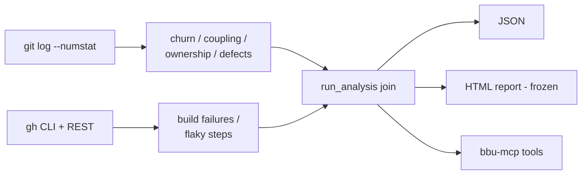

# Agent-Native Pivot Implementation Plan

> **For agentic workers:** REQUIRED SUB-SKILL: Use superpowers:subagent-driven-development (recommended) or superpowers:executing-plans to implement this plan task-by-task. Steps use checkbox (`- [ ]`) syntax for tracking.

**Goal:** Repair the correctness of every forensic signal bbu emits, then ship those signals as agent context via an MCP server and a rewritten Claude Code plugin, released as v1.0.0.

**Architecture:** Milestone A replaces the undeclared `gmap` Rust dependency with native `git log --numstat` parsing, fixes the hotspot formula (currently churn × churn) with Tornhill's indentation-depth complexity proxy, adds bug-fix commit linkage so the "files cause defects" pitch is measurable, rewrites flaky-step detection against real GitHub API re-run semantics, and makes degraded modes loud via loguru. Milestone B exposes the now-correct `AnalysisResult` through a FastMCP server (`bbu-mcp`) and rewrites the stale `.claude-plugin` to actually invoke bbu. The HTML report is frozen: it must keep working but gets no new features.

**Tech Stack:** Python 3.10+, pydantic v2, typer, loguru, pytest, `mcp` (FastMCP) SDK, `gh` CLI (optional CI signals), git.

**Context for the executor:**
- Repo: `/Users/mdenyer/VSCode/black-box-unlock`. Run all commands from the repo root.
- Tests: `uv run pytest -v`. Lint: `uv run ruff check . && uv run ruff format .`
- Pre-commit runs ruff on commit. Never use `--quiet` flags anywhere.
- Commit messages: conventional commits (`feat:`, `fix:`, `test:`, `docs:`, `chore:`), no AI attribution.
- The `{"entries": [...]}` dict shape is the contract between extraction and the three parsers (`churn`, `ownership`, `coupling`). Task 1 preserves it exactly and adds one key (`message`).
- Tasks must be executed in order. Milestone B (Tasks 10-12) must not start until Milestone A is complete — the MCP server must never serve the broken signals.

**Out of scope (do not do these):** new HTML report features; PR cycle time / review comment density / rollback rate / deploy frequency signals; IDE telemetry; JUnit/pytest log parsing; the code-review-graph upstream PR (tracked as a separate beads issue, different repo).

---

## Milestone A — Make the signals true

### Task 1: Native git history extraction

The pipeline currently shells out to `gmap`, a niche third-party Rust binary. The JSON it provides is plain `git log --numstat` data. Replace it with a native fetcher that produces the exact dict shape the existing parsers consume, plus the commit subject (needed by Task 6).

**Files:**
- Create: `src/black_box_unlock/git/log.py`
- Test: `tests/unit/git/test_log.py`

- [ ] **Step 1: Write the failing tests**

Create `tests/unit/git/test_log.py`:

```python
"""Unit tests for native git history extraction."""

from pathlib import Path
from unittest.mock import patch

import pytest

from black_box_unlock.core.exceptions import GitToolNotFoundError, NotAGitRepoError
from black_box_unlock.git.log import _parse_log_output, fetch_git_history

# \x01 marks a commit record; fields are tab-separated: iso-date, email, subject
SAMPLE_LOG = (
    "\x012026-01-20T10:00:00+00:00\talice@example.com\tfeat: add auth\n"
    "100\t20\tsrc/auth.py\n"
    "50\t10\tsrc/user.py\n"
    "\n"
    "\x012026-01-21T10:00:00+00:00\tbob@example.com\tfix: token bug\n"
    "30\t5\tsrc/auth.py\n"
    "-\t-\tassets/logo.png\n"
)


class TestParseLogOutput:
    def test_parses_commits_into_entries(self):
        """Each commit becomes an entry with timestamp, author, message, files."""
        data = _parse_log_output(SAMPLE_LOG)

        assert len(data["entries"]) == 2
        first = data["entries"][0]
        assert first["timestamp"] == "2026-01-20T10:00:00+00:00"
        assert first["author_email"] == "alice@example.com"
        assert first["message"] == "feat: add auth"
        assert first["files"] == [
            {"path": "src/auth.py", "added_lines": 100, "deleted_lines": 20},
            {"path": "src/user.py", "added_lines": 50, "deleted_lines": 10},
        ]

    def test_skips_binary_files(self):
        """Binary numstat lines (- as counts) are skipped."""
        data = _parse_log_output(SAMPLE_LOG)

        second = data["entries"][1]
        assert second["files"] == [
            {"path": "src/auth.py", "added_lines": 30, "deleted_lines": 5}
        ]

    def test_empty_log_gives_empty_entries(self):
        assert _parse_log_output("") == {"entries": []}


class TestFetchGitHistory:
    def test_raises_not_a_git_repo(self, tmp_path):
        with pytest.raises(NotAGitRepoError):
            fetch_git_history(tmp_path, days=30)

    @patch("black_box_unlock.git.log.subprocess.run")
    def test_raises_git_tool_not_found(self, mock_run, tmp_path):
        (tmp_path / ".git").mkdir()
        mock_run.side_effect = FileNotFoundError(2, "No such file or directory", "git")

        with pytest.raises(GitToolNotFoundError):
            fetch_git_history(tmp_path, days=30)

    @patch("black_box_unlock.git.log.subprocess.run")
    def test_invokes_git_log_with_since_window(self, mock_run, tmp_path):
        (tmp_path / ".git").mkdir()
        mock_run.return_value.stdout = SAMPLE_LOG

        data = fetch_git_history(tmp_path, days=45)

        cmd = mock_run.call_args[0][0]
        assert cmd[:3] == ["git", "-C", str(tmp_path)]
        assert "--since=45 days ago" in cmd
        assert "--numstat" in cmd
        assert len(data["entries"]) == 2
```

- [ ] **Step 2: Run tests to verify they fail**

Run: `uv run pytest tests/unit/git/test_log.py -v`
Expected: FAIL with `ModuleNotFoundError: No module named 'black_box_unlock.git.log'`

- [ ] **Step 3: Implement `git/log.py`**

Create `src/black_box_unlock/git/log.py`:

```python
"""Native git history extraction via git log --numstat."""

import subprocess
from pathlib import Path
from typing import Any

from ..core.exceptions import GitToolNotFoundError, NotAGitRepoError

# \x01 marks the start of a commit record so we never collide with file content.
_COMMIT_MARKER = "\x01"
_PRETTY_FORMAT = f"{_COMMIT_MARKER}%aI%x09%ae%x09%s"


def fetch_git_history(repo_path: Path, days: int) -> dict[str, Any]:
    """Fetch commit history with per-file line stats.

    Returns:
        Dict of shape {"entries": [{"timestamp", "author_email", "message",
        "files": [{"path", "added_lines", "deleted_lines"}]}]} — the contract
        consumed by the churn/ownership/coupling parsers.

    Raises:
        NotAGitRepoError: If repo_path is not a git repository.
        GitToolNotFoundError: If the git binary is not installed.
    """
    if not (repo_path / ".git").exists():
        raise NotAGitRepoError(f"Not a git repository: {repo_path}")

    cmd = [
        "git",
        "-C",
        str(repo_path),
        "log",
        f"--since={days} days ago",
        "--numstat",
        "--no-renames",
        f"--pretty=format:{_PRETTY_FORMAT}",
    ]
    try:
        result = subprocess.run(cmd, capture_output=True, text=True, check=True)
    except FileNotFoundError as e:
        raise GitToolNotFoundError("git not found on PATH") from e
    return _parse_log_output(result.stdout)


def _parse_log_output(output: str) -> dict[str, Any]:
    """Parse git log --numstat output into the entries dict."""
    entries: list[dict[str, Any]] = []
    current: dict[str, Any] | None = None

    for line in output.splitlines():
        if line.startswith(_COMMIT_MARKER):
            timestamp, author_email, message = line[1:].split("\t", 2)
            current = {
                "timestamp": timestamp,
                "author_email": author_email,
                "message": message,
                "files": [],
            }
            entries.append(current)
        elif line.strip() and current is not None:
            added, deleted, path = line.split("\t", 2)
            if added == "-" or deleted == "-":
                continue  # binary file
            current["files"].append(
                {"path": path, "added_lines": int(added), "deleted_lines": int(deleted)}
            )

    return {"entries": entries}
```

- [ ] **Step 4: Run tests to verify they pass**

Run: `uv run pytest tests/unit/git/test_log.py -v`
Expected: 6 PASS

- [ ] **Step 5: Lint and commit**

```bash
uv run ruff check . && uv run ruff format .
git add src/black_box_unlock/git/log.py tests/unit/git/test_log.py
git commit -m "feat(git): native git log --numstat history extraction"
```

---

### Task 2: Swap the pipeline to native git and remove gmap

**Files:**
- Modify: `src/black_box_unlock/analysis.py` (delete `_fetch_gmap_data`, use `fetch_git_history`)
- Modify: `src/black_box_unlock/git/churn.py` (rename parser, drop gmap subprocess)
- Modify: `src/black_box_unlock/git/ownership.py` (rename only)
- Modify: `tests/unit/test_analysis.py`, `tests/unit/git/test_churn.py`, `tests/unit/test_ownership.py`, `tests/unit/test_temporal_coupling.py` (imports/patch targets)
- Modify: `tests/conftest.py` (drop `requires_gmap` machinery)
- Modify: `README.md` (drop the gmap install block), `CHANGELOG.md`

- [ ] **Step 1: Update the patch targets in `tests/unit/test_analysis.py` so they fail**

Every `patch("black_box_unlock.analysis._fetch_gmap_data")` becomes `patch("black_box_unlock.analysis.fetch_git_history")` (8 occurrences). Delete the `TestFetchGmapData` class entirely (its behavior now lives in `tests/unit/git/test_log.py::TestFetchGitHistory`) and the now-unused `_fetch_gmap_data` / `GitToolNotFoundError` imports at the top of the file (keep `_fetch_ci_failures`).

Run: `uv run pytest tests/unit/test_analysis.py -v`
Expected: FAIL — `AttributeError: <module 'black_box_unlock.analysis'> does not have the attribute 'fetch_git_history'`

- [ ] **Step 2: Rewire `analysis.py`**

In `src/black_box_unlock/analysis.py`:

1. Delete the entire `_fetch_gmap_data` function and the `GitToolNotFoundError` import.
2. Add to the imports: `from .git.log import fetch_git_history`
3. In `run_analysis`, replace `gmap_data = _fetch_gmap_data(repo_path, days)` with:

```python
    history = fetch_git_history(repo_path, days)
```

4. Replace the three parser calls to use `history`:

```python
    churn_list = parse_history_entries(history)
    ownership_list = parse_ownership_from_history(history)
    coupling_list = detect_temporal_coupling(history, min_ratio=min_coupling)
```

(the renamed parsers are created in the next step)

- [ ] **Step 3: Rename the gmap-named parsers**

- `src/black_box_unlock/git/churn.py`: rename `parse_gmap_output` → `parse_history_entries`; update its docstring first line to "Parse git history entries into FileChurn models."; rewrite `extract_file_churn` to drop the subprocess entirely:

```python
"""File churn extraction from git history."""

from collections import defaultdict
from datetime import datetime
from pathlib import Path
from typing import Any

from ..core.models import FileChurn
from .log import fetch_git_history


def parse_history_entries(data: dict[str, Any]) -> list[FileChurn]:  # [3a]
    """Parse git history entries into FileChurn models.

    Aggregates commits and line changes per file across all entries.
    """
    file_stats: dict[str, dict[str, Any]] = defaultdict(
        lambda: {"commits": 0, "lines_added": 0, "lines_deleted": 0, "timestamps": []}
    )

    for entry in data.get("entries", []):
        timestamp = datetime.fromisoformat(entry["timestamp"].replace("Z", "+00:00"))
        for file_info in entry.get("files", []):
            stats = file_stats[file_info["path"]]
            stats["commits"] += 1
            stats["lines_added"] += file_info["added_lines"]
            stats["lines_deleted"] += file_info["deleted_lines"]
            stats["timestamps"].append(timestamp)

    return [
        FileChurn(
            path=path,
            commits=stats["commits"],
            lines_added=stats["lines_added"],
            lines_deleted=stats["lines_deleted"],
            first_commit=min(stats["timestamps"]).replace(tzinfo=None),
            last_commit=max(stats["timestamps"]).replace(tzinfo=None),
        )
        for path, stats in file_stats.items()
    ]


def extract_file_churn(repo_path: Path, since_days: int = 30) -> list[FileChurn]:  # [3a.1]
    """Extract file churn metrics from git history.

    Raises:
        NotAGitRepoError: If repo_path is not a git repository.
        GitToolNotFoundError: If git is not installed.
    """
    return parse_history_entries(fetch_git_history(repo_path, since_days))
```

- `src/black_box_unlock/git/ownership.py`: rename `parse_ownership_from_gmap` → `parse_ownership_from_history` (signature and body unchanged; update docstring references to gmap).
- Update imports/calls in: `src/black_box_unlock/analysis.py`, `tests/unit/git/test_churn.py`, `tests/unit/test_ownership.py`. Check for any other references: `grep -rn "gmap" src/ tests/ --include="*.py"` — after this step the only hits should be in `tests/conftest.py` (removed next step).

- [ ] **Step 4: Drop the gmap test machinery**

- `tests/conftest.py`: delete the `requires_gmap` marker registration, the `gmap_available` / `skip_gmap` lines in `pytest_collection_modifyitems` (keep all `requires_gh` handling).
- `tests/integration/test_git_churn.py`: delete the `@pytest.mark.requires_gmap` decorator (the test body is rewritten in Task 3).

- [ ] **Step 5: Run the full suite**

Run: `uv run pytest -v`
Expected: all unit tests PASS. `tests/integration/test_git_churn.py::test_extracts_churn_from_this_repo` may still FAIL (time-dependent — fixed in Task 3); everything else green.

- [ ] **Step 6: Remove gmap from the docs**

- `README.md`: delete the gmap paragraph and code block from Installation (the block starting "`bbu analyze-repo` also requires the [gmap](https://crates.io/crates/gmap) Rust CLI..." through "...exits with an error."). Keep the `gh` sentence: "CI failure analysis uses the [gh](https://cli.github.com/) CLI when available (skip with `--no-ci`)."
- `CHANGELOG.md`: under `## [Unreleased]` add:

```markdown
### Changed
- Git history extraction is now native (`git log --numstat`) — the gmap Rust CLI is no longer required
```

- [ ] **Step 7: Commit**

```bash
git add -A
git commit -m "feat(git): replace gmap dependency with native git log extraction

gmap was an undeclared third-party Rust binary; the data consumed was
plain numstat output. Native extraction removes the install trap and
lets integration tests run in CI."
```

---

### Task 3: Deterministic fixture-repo integration test

The current integration test asserts the bbu repo itself has commits in the last 30 days — it fails whenever the repo sits idle for a month, and it never ran in CI (gmap was absent there). Replace it with a fixture repo built in `tmp_path`.

**Files:**
- Rewrite: `tests/integration/test_git_churn.py`

- [ ] **Step 1: Rewrite the test file**

Replace the entire contents of `tests/integration/test_git_churn.py` with:

```python
"""Integration tests for git churn extraction against a real repository."""

import subprocess
from pathlib import Path

import pytest

from black_box_unlock.git.churn import extract_file_churn


@pytest.fixture
def fixture_repo(tmp_path: Path) -> Path:
    """Build a real git repo with two commits touching two files."""
    repo = tmp_path / "repo"
    repo.mkdir()

    def git(*args: str) -> None:
        subprocess.run(
            ["git", "-C", str(repo), *args],
            check=True,
            capture_output=True,
            env={
                "GIT_AUTHOR_NAME": "Alice",
                "GIT_AUTHOR_EMAIL": "alice@example.com",
                "GIT_COMMITTER_NAME": "Alice",
                "GIT_COMMITTER_EMAIL": "alice@example.com",
                "PATH": "/usr/bin:/bin",
                "HOME": str(tmp_path),
            },
        )

    git("init")
    (repo / "main.py").write_text("print('hello')\n")
    git("add", "main.py")
    git("commit", "-m", "feat: initial")
    (repo / "main.py").write_text("print('hello')\nprint('world')\n")
    (repo / "util.py").write_text("x = 1\n")
    git("add", "main.py", "util.py")
    git("commit", "-m", "fix: add world and util")
    return repo


class TestExtractFileChurnIntegration:
    def test_extracts_churn_from_fixture_repo(self, fixture_repo):
        result = extract_file_churn(fixture_repo, since_days=30)

        by_path = {c.path: c for c in result}
        assert set(by_path) == {"main.py", "util.py"}
        assert by_path["main.py"].commits == 2
        assert by_path["util.py"].commits == 1
        assert by_path["main.py"].lines_added == 3  # 1 initial + 2 in second commit... verify below

    def test_results_sortable_by_churn(self, fixture_repo):
        result = extract_file_churn(fixture_repo, since_days=30)

        ranked = sorted(result, key=lambda c: c.total_lines_changed, reverse=True)
        assert ranked[0].path == "main.py"
```

Note for the executor on the `lines_added` assertion: the second commit rewrites `main.py` from 1 line to 2 lines, which numstat reports as +2/-1 (it replaces the line). Run the test, read the actual numstat values, and pin the assertion to what git reports — the point is determinism, not guessing. If the observed value differs from 3, set the assertion to the observed value and add a comment explaining the numstat arithmetic.

- [ ] **Step 2: Run the integration tests**

Run: `uv run pytest tests/integration/test_git_churn.py -v`
Expected: 2 PASS (fix the `lines_added` pin per the note if needed)

- [ ] **Step 3: Run the full suite — it must be fully green now**

Run: `uv run pytest -v`
Expected: ALL tests pass, including in a checkout with no recent commits.

- [ ] **Step 4: Commit**

```bash
git add tests/integration/test_git_churn.py
git commit -m "test: deterministic fixture-repo integration test for churn

Replaces the wall-clock-dependent test that failed whenever the repo
had no commits in the last 30 days."
```

---

### Task 4: Thread repo_path through subprocess calls, add --repo flag

`gh` and `git show` in the cicd module resolve the repo from the process cwd while git history uses `repo_path` — analyzing any repo other than the cwd would silently mix data from two repos. Hidden today only because the CLI hardcodes `Path(".")`.

**Files:**
- Modify: `src/black_box_unlock/cicd/github_actions.py` (every function gains `repo_path`)
- Modify: `src/black_box_unlock/analysis.py` (`_fetch_ci_failures(repo_path)`)
- Modify: `src/black_box_unlock/cli.py` (`--repo` option)
- Modify: `tests/unit/cicd/test_github_actions.py`, `tests/unit/test_cli.py`

- [ ] **Step 1: Write the failing tests**

Add to `tests/unit/cicd/test_github_actions.py`:

```python
class TestRepoPathThreading:
    @patch("black_box_unlock.cicd.github_actions.subprocess.run")
    def test_fetch_workflow_runs_uses_repo_cwd(self, mock_run, tmp_path):
        mock_run.return_value.stdout = "[]"

        fetch_workflow_runs(limit=10, repo_path=tmp_path)

        assert mock_run.call_args.kwargs["cwd"] == tmp_path

    @patch("black_box_unlock.cicd.github_actions.subprocess.run")
    def test_get_files_changed_uses_repo_cwd(self, mock_run, tmp_path):
        mock_run.return_value.stdout = "src/a.py\n"

        get_files_changed("abc123", repo_path=tmp_path)

        assert mock_run.call_args.kwargs["cwd"] == tmp_path
```

(import `tmp_path` is a built-in fixture; add `fetch_workflow_runs`, `get_files_changed` to the existing imports if missing.)

Add to `tests/unit/test_cli.py` inside `TestAnalyzeRepoCommand`:

```python
    def test_repo_option_is_passed_to_run_analysis(self):
        """--repo option sets the repo path."""
        mock_result = MagicMock()
        mock_result.files = []

        with patch("black_box_unlock.cli.run_analysis") as mock_analysis:
            mock_analysis.return_value = mock_result
            with patch("black_box_unlock.cli.export_to_json") as mock_export:
                mock_export.return_value = "{}"
                runner.invoke(app, ["analyze-repo", "--repo", "/some/repo", "--output", "json"])

        assert mock_analysis.call_args[0][0] == Path("/some/repo")
```

- [ ] **Step 2: Run to verify failures**

Run: `uv run pytest tests/unit/cicd/test_github_actions.py::TestRepoPathThreading tests/unit/test_cli.py::TestAnalyzeRepoCommand::test_repo_option_is_passed_to_run_analysis -v`
Expected: FAIL (`TypeError: ... unexpected keyword argument 'repo_path'`, and cwd assertion failure)

- [ ] **Step 3: Implement**

In `src/black_box_unlock/cicd/github_actions.py`:
- Add `from pathlib import Path` to imports.
- Change signatures and add `cwd=repo_path` to every `subprocess.run` call:
  - `fetch_workflow_runs(limit: int = 100, repo_path: Path = Path(".")) -> list[WorkflowRun]`
  - `get_files_changed(commit_sha: str, repo_path: Path = Path(".")) -> list[str]`
  - `build_failures_from_runs(runs: list[WorkflowRun], repo_path: Path = Path(".")) -> list[BuildFailure]` — pass `repo_path` to its `get_files_changed` call
  - `fetch_all_runs(limit: int = 100, repo_path: Path = Path(".")) -> list[dict]`
  - `fetch_jobs_for_run(run_id: int, repo_path: Path = Path(".")) -> list[dict]`

In `src/black_box_unlock/analysis.py`:

```python
def _fetch_ci_failures(repo_path: Path) -> dict[str, int]:
    """Fetch CI failure counts per file."""
    try:
        runs = fetch_workflow_runs(limit=100, repo_path=repo_path)
        failures = build_failures_from_runs(runs, repo_path=repo_path)
        return aggregate_file_failures(failures)
    except Exception:
        # CI data is optional - gracefully degrade (logging added in Task 8)
        return {}
```

and in `run_analysis` change the call to `ci_failures = _fetch_ci_failures(repo_path)`.

In `src/black_box_unlock/cli.py` `analyze_repo`, add the option and use it:

```python
    repo: Path = typer.Option(Path("."), "--repo", help="Path to the git repository to analyze"),
```

and replace `repo_path = Path(".")` with `repo_path = repo`.

- [ ] **Step 4: Run the full suite**

Run: `uv run pytest -v`
Expected: ALL PASS. The existing `_fetch_ci_failures` test (`TestFetchCIFailures::test_returns_empty_dict_on_exception`) needs its call updated to `_fetch_ci_failures(Path("."))`.

- [ ] **Step 5: Commit**

```bash
git add -A
git commit -m "fix(cicd): thread repo_path through gh/git subprocess calls, add --repo flag

gh and git show previously resolved the repo from process cwd while git
history used repo_path - analyzing a repo other than the cwd would
silently mix data from two repositories."
```

---

### Task 5: Indentation complexity and a true hotspot score

`hotspot_score` is `commits * lines_changed` — churn × churn — while every doc claims churn × complexity. Implement Tornhill's cheap complexity proxy (sum of logical indentation levels) and make the formula real.

**Files:**
- Create: `src/black_box_unlock/complexity.py`
- Test: `tests/unit/test_complexity.py`
- Modify: `src/black_box_unlock/core/models.py` (FileForensics gains `complexity`, hotspot formula changes)
- Modify: `src/black_box_unlock/analysis.py` (compute complexity per file)
- Modify: `tests/unit/test_analysis.py`, `tests/unit/visualization/test_treemap.py` (expectations)

- [ ] **Step 1: Write the failing complexity tests**

Create `tests/unit/test_complexity.py`:

```python
"""Unit tests for indentation-based complexity."""

from black_box_unlock.complexity import indentation_complexity


class TestIndentationComplexity:
    def test_flat_file_has_zero_complexity(self, tmp_path):
        f = tmp_path / "flat.py"
        f.write_text("a = 1\nb = 2\n")

        assert indentation_complexity(f) == 0.0

    def test_sums_indentation_levels(self, tmp_path):
        f = tmp_path / "nested.py"
        f.write_text(
            "def f():\n"          # 0 levels
            "    if x:\n"          # 1 level
            "        return 1\n"   # 2 levels
        )

        assert indentation_complexity(f) == 3.0

    def test_tabs_count_as_one_level(self, tmp_path):
        f = tmp_path / "tabs.py"
        f.write_text("def f():\n\treturn 1\n")

        assert indentation_complexity(f) == 1.0

    def test_blank_lines_ignored(self, tmp_path):
        f = tmp_path / "blanks.py"
        f.write_text("def f():\n\n    return 1\n")

        assert indentation_complexity(f) == 1.0

    def test_missing_file_is_zero(self, tmp_path):
        assert indentation_complexity(tmp_path / "gone.py") == 0.0
```

- [ ] **Step 2: Run to verify failure**

Run: `uv run pytest tests/unit/test_complexity.py -v`
Expected: FAIL with `ModuleNotFoundError`

- [ ] **Step 3: Implement `complexity.py`**

Create `src/black_box_unlock/complexity.py`:

```python
"""Indentation-based complexity proxy (Tornhill's whitespace method)."""

from pathlib import Path

TAB_SIZE = 4


def indentation_complexity(file_path: Path, tab_size: int = TAB_SIZE) -> float:
    """Sum of logical indentation levels across non-blank lines.

    Cheap, language-agnostic complexity proxy: deeply nested code
    accumulates indentation. Returns 0.0 for missing or unreadable files
    (e.g. deleted within the analysis window).
    """
    try:
        text = file_path.read_text(errors="ignore")
    except OSError:
        return 0.0

    total = 0
    for line in text.splitlines():
        if not line.strip():
            continue
        expanded = line.expandtabs(tab_size)
        total += (len(expanded) - len(expanded.lstrip(" "))) // tab_size
    return float(total)
```

- [ ] **Step 4: Run complexity tests**

Run: `uv run pytest tests/unit/test_complexity.py -v`
Expected: 5 PASS

- [ ] **Step 5: Change the model and the pipeline (test-first)**

In `tests/unit/test_analysis.py`, replace `test_hotspot_score_is_commits_times_lines_changed` with:

```python
    def test_hotspot_score_is_commits_times_complexity(self):
        """hotspot_score is commits × complexity (Tornhill's formula)."""
        forensics = FileForensics(
            path="src/auth.py",
            commits=42,
            lines_changed=1234,
            complexity=10.0,
            authors=["alice@example.com"],
            coupled_with=[],
        )

        assert forensics.hotspot_score == 420.0
```

and in `test_includes_computed_properties` add `complexity=200.0` to the `FileForensics(...)` constructor and keep `assert parsed["files"][0]["hotspot_score"] == 2000  # 10 commits * 200.0 complexity`.

Run: `uv run pytest tests/unit/test_analysis.py -v` → expected FAIL (`complexity` unknown field).

In `src/black_box_unlock/core/models.py` `FileForensics`, add the field after `lines_changed`:

```python
    complexity: float = 0.0
```

and replace the `hotspot_score` computed field:

```python
    @computed_field
    @property
    def hotspot_score(self) -> float:
        """Hotspot score = commits x complexity (Tornhill: change frequency x complexity)."""
        return self.commits * self.complexity
```

In `src/black_box_unlock/analysis.py`: add `from .complexity import indentation_complexity` and in the `FileForensics(...)` construction inside `run_analysis` add:

```python
                complexity=indentation_complexity(repo_path / path),
```

- [ ] **Step 6: Repair the tests that asserted the old formula**

- `tests/unit/test_analysis.py::test_computes_hotspot_scores`: the mocked run uses `Path("/fake/repo")` so every file's complexity is 0.0 and ordering is undefined. Patch complexity per-path:

```python
    def test_computes_hotspot_scores(self):
        """Files are sorted by hotspot_score descending."""
        gmap_output = {
            "entries": [
                {
                    "timestamp": "2026-01-20T10:00:00Z",
                    "author_email": "alice@example.com",
                    "files": [
                        {"path": "low.py", "added_lines": 10, "deleted_lines": 0},
                        {"path": "high.py", "added_lines": 1000, "deleted_lines": 0},
                    ],
                },
            ]
        }
        complexity_by_path = {"low.py": 1.0, "high.py": 50.0}

        with patch("black_box_unlock.analysis.fetch_git_history") as mock_fetch:
            mock_fetch.return_value = gmap_output
            with patch("black_box_unlock.analysis.indentation_complexity") as mock_cx:
                mock_cx.side_effect = lambda p: complexity_by_path.get(p.name, 0.0)
                result = run_analysis(Path("/fake/repo"), days=30)

        assert result.files[0].path == "high.py"
        assert result.files[1].path == "low.py"
```

- `tests/unit/visualization/test_treemap.py::test_colors_are_hotspot_scores`: the fixture's `FileForensics` objects now produce `hotspot_score = commits * complexity`. Set an explicit `complexity=` on each fixture object and update the expected color values to `commits * complexity`. Do not change treemap code — the HTML surface is frozen; only the fixture expectations move.
- Any other failures from the formula change: same treatment — set `complexity` explicitly in the fixture, recompute the expectation. Find them with `uv run pytest -v 2>&1 | grep FAILED`.

- [ ] **Step 7: Full suite, lint, commit**

Run: `uv run pytest -v` → ALL PASS, then:

```bash
uv run ruff check . && uv run ruff format .
git add -A
git commit -m "feat(core): hotspot score is now commits x indentation complexity

The previous score was commits x lines_changed - churn x churn - while
every doc claimed Tornhill's churn x complexity. Indentation depth is
Tornhill's own cheap language-agnostic proxy."
```

---

### Task 6: Defect linkage — bug-fix commit detection

The headline pitch ("2-8% of files cause 60-90% of defects") was never measurable: no signal touched defect data. Count bug-fix commits per file from commit messages.

**Files:**
- Create: `src/black_box_unlock/git/defects.py`
- Test: `tests/unit/git/test_defects.py`
- Modify: `src/black_box_unlock/core/models.py` (FileForensics gains `bugfix_commits`)
- Modify: `src/black_box_unlock/analysis.py` (join the counts)

- [ ] **Step 1: Write the failing tests**

Create `tests/unit/git/test_defects.py`:

```python
"""Unit tests for bug-fix commit detection."""

from black_box_unlock.git.defects import bugfix_counts, is_bugfix_message


class TestIsBugfixMessage:
    def test_detects_fix_prefix(self):
        assert is_bugfix_message("fix: handle null token") is True

    def test_detects_fixes_issue_reference(self):
        assert is_bugfix_message("Fixes #142 race in retry loop") is True

    def test_detects_bug_word(self):
        assert is_bugfix_message("squash auth bug under load") is True

    def test_detects_revert(self):
        assert is_bugfix_message('Revert "feat: new cache layer"') is True

    def test_feature_commit_is_not_bugfix(self):
        assert is_bugfix_message("feat: add login page") is False

    def test_word_boundary_no_false_positive(self):
        # "prefix" contains "fix" but is not a bugfix marker
        assert is_bugfix_message("docs: explain url prefix handling") is False


class TestBugfixCounts:
    def test_counts_bugfix_commits_per_file(self):
        history = {
            "entries": [
                {
                    "timestamp": "2026-01-20T10:00:00Z",
                    "author_email": "a@x.com",
                    "message": "fix: auth crash",
                    "files": [
                        {"path": "src/auth.py", "added_lines": 5, "deleted_lines": 1},
                        {"path": "src/user.py", "added_lines": 2, "deleted_lines": 0},
                    ],
                },
                {
                    "timestamp": "2026-01-21T10:00:00Z",
                    "author_email": "a@x.com",
                    "message": "feat: add profile page",
                    "files": [{"path": "src/user.py", "added_lines": 50, "deleted_lines": 0}],
                },
                {
                    "timestamp": "2026-01-22T10:00:00Z",
                    "author_email": "a@x.com",
                    "message": "hotfix: auth again",
                    "files": [{"path": "src/auth.py", "added_lines": 3, "deleted_lines": 3}],
                },
            ]
        }

        counts = bugfix_counts(history)

        assert counts == {"src/auth.py": 2, "src/user.py": 1}

    def test_entries_without_message_are_skipped(self):
        history = {"entries": [{"timestamp": "2026-01-20T10:00:00Z", "author_email": "a@x.com", "files": []}]}

        assert bugfix_counts(history) == {}
```

- [ ] **Step 2: Run to verify failure**

Run: `uv run pytest tests/unit/git/test_defects.py -v`
Expected: FAIL with `ModuleNotFoundError`

- [ ] **Step 3: Implement `git/defects.py`**

```python
"""Bug-fix commit detection from commit messages."""

import re
from collections import Counter
from typing import Any

BUGFIX_PATTERN = re.compile(
    r"(\bfix(es|ed)?\b|\bbug(fix)?\b|\bhotfix\b|\bdefect\b|\brevert\b|\bregression\b)",
    re.IGNORECASE,
)


def is_bugfix_message(message: str) -> bool:
    """True when a commit message indicates a defect repair."""
    return bool(BUGFIX_PATTERN.search(message))


def bugfix_counts(history: dict[str, Any]) -> dict[str, int]:
    """Count bug-fix commits per file path.

    Files repeatedly touched by fix commits are where defects live —
    this is the defect axis of Tornhill's hotspot validation.
    """
    counts: Counter[str] = Counter()
    for entry in history.get("entries", []):
        message = entry.get("message")
        if not message or not is_bugfix_message(message):
            continue
        for file_info in entry.get("files", []):
            counts[file_info["path"]] += 1
    return dict(counts)
```

- [ ] **Step 4: Run defects tests**

Run: `uv run pytest tests/unit/git/test_defects.py -v`
Expected: 8 PASS

- [ ] **Step 5: Join into the pipeline (test-first)**

Add to `tests/unit/test_analysis.py` (new test in `TestRunAnalysis`):

```python
    def test_includes_bugfix_commit_counts(self):
        """File forensics include bugfix_commits from commit messages."""
        gmap_output = {
            "entries": [
                {
                    "timestamp": "2026-01-20T10:00:00Z",
                    "author_email": "a@x.com",
                    "message": "fix: crash on empty input",
                    "files": [{"path": "src/auth.py", "added_lines": 5, "deleted_lines": 1}],
                },
            ]
        }

        with patch("black_box_unlock.analysis.fetch_git_history") as mock_fetch:
            mock_fetch.return_value = gmap_output
            result = run_analysis(Path("/fake/repo"), days=30)

        auth = next(f for f in result.files if f.path == "src/auth.py")
        assert auth.bugfix_commits == 1
```

Run it → FAIL. Then:

- `src/black_box_unlock/core/models.py` `FileForensics`: add after `build_failures`:

```python
    bugfix_commits: int = 0
```

- `src/black_box_unlock/analysis.py`: add `from .git.defects import bugfix_counts` to imports; in `run_analysis` after the coupling lookup add `defect_counts = bugfix_counts(history)` and in the `FileForensics(...)` construction add:

```python
                bugfix_commits=defect_counts.get(path, 0),
```

- [ ] **Step 6: Full suite and commit**

Run: `uv run pytest -v` → ALL PASS

```bash
git add -A
git commit -m "feat(git): bug-fix commit linkage per file

Counts defect-repair commits (fix/bug/hotfix/revert/regression markers)
per file, making the 'few files cause most defects' claim measurable
instead of asserted."
```

---

### Task 7: Rewrite flaky detection against real GitHub API semantics

The current detector groups runs by `run.get("workflow_name")` — a field the `/actions/runs` REST response does not have (it's `name`) — and assumes re-runs appear as separate list entries, which they don't (GitHub mutates the run in place, incrementing `run_attempt`; the runs list shows the latest attempt only). It also emits consistently-broken steps (>10% failure rate) as "flaky" and makes one `gh api` call per run (N+1). Verified test fixtures fabricated the wrong shapes, so 19 tests passed against an API that doesn't exist.

The real signal: a run with `run_attempt > 1` was re-run; `/actions/runs/{id}/jobs?filter=all&per_page=100` returns jobs from ALL attempts, each job carrying `run_attempt`. A step that failed in attempt N and succeeded in attempt M>N of the same run is flaky.

**Files:**
- Modify: `src/black_box_unlock/cicd/github_actions.py` (rewrite `detect_flaky_steps`, add pure `flaky_steps_from_jobs`, fix `fetch_jobs_for_run` URL, delete `_step_passed_in_jobs`)
- Rewrite: `tests/unit/cicd/test_flaky_detection.py`

- [ ] **Step 1: Rewrite the test file with realistic fixtures**

Replace the contents of `tests/unit/cicd/test_flaky_detection.py` with:

```python
"""Unit tests for flaky step detection (real GitHub API shapes)."""

from pathlib import Path
from unittest.mock import patch

from black_box_unlock.cicd.github_actions import (
    detect_flaky_steps,
    flaky_steps_from_jobs,
)


def _job(run_attempt: int, steps: list[tuple[str, str]], name: str = "test (3.11)") -> dict:
    """A job dict as returned by /actions/runs/{id}/jobs?filter=all."""
    return {
        "name": name,
        "run_attempt": run_attempt,
        "steps": [
            {
                "name": step_name,
                "conclusion": conclusion,
                "completed_at": f"2026-06-0{run_attempt}T10:00:00Z",
            }
            for step_name, conclusion in steps
        ],
    }


class TestFlakyStepsFromJobs:
    def test_fail_then_pass_across_attempts_is_flaky(self):
        jobs = [
            _job(1, [("Run tests", "failure"), ("Checkout", "success")]),
            _job(2, [("Run tests", "success"), ("Checkout", "success")]),
        ]

        flaky = flaky_steps_from_jobs(jobs)

        assert len(flaky) == 1
        step = flaky[0]
        assert step.step_name == "Run tests"
        assert step.job_name == "test (3.11)"
        assert step.flaky_count == 1
        assert step.failures == 1
        assert step.total_runs == 2

    def test_consistent_failure_is_not_flaky(self):
        jobs = [
            _job(1, [("Run tests", "failure")]),
            _job(2, [("Run tests", "failure")]),
        ]

        assert flaky_steps_from_jobs(jobs) == []

    def test_all_green_is_not_flaky(self):
        jobs = [
            _job(1, [("Run tests", "success")]),
            _job(2, [("Run tests", "success")]),
        ]

        assert flaky_steps_from_jobs(jobs) == []

    def test_skipped_steps_ignored(self):
        jobs = [
            _job(1, [("Deploy", "skipped")]),
            _job(2, [("Deploy", "skipped")]),
        ]

        assert flaky_steps_from_jobs(jobs) == []

    def test_tracks_first_and_last_seen(self):
        jobs = [
            _job(1, [("Run tests", "failure")]),
            _job(2, [("Run tests", "success")]),
        ]

        step = flaky_steps_from_jobs(jobs)[0]
        assert step.first_seen.day == 1
        assert step.last_seen.day == 2


class TestDetectFlakySteps:
    @patch("black_box_unlock.cicd.github_actions.fetch_jobs_for_run")
    @patch("black_box_unlock.cicd.github_actions.fetch_all_runs")
    def test_only_fetches_jobs_for_rerun_runs(self, mock_runs, mock_jobs):
        """Runs with run_attempt == 1 were never re-run - no jobs fetch needed."""
        mock_runs.return_value = [
            {"id": 1, "run_attempt": 1, "name": "CI"},
            {"id": 2, "run_attempt": 3, "name": "CI"},
        ]
        mock_jobs.return_value = [
            _job(1, [("Run tests", "failure")]),
            _job(3, [("Run tests", "success")]),
        ]

        flaky = detect_flaky_steps(repo_path=Path("."), limit=50)

        mock_jobs.assert_called_once_with(2, repo_path=Path("."))
        assert len(flaky) == 1
        assert flaky[0].flaky_count == 1

    @patch("black_box_unlock.cicd.github_actions.fetch_all_runs")
    def test_no_reruns_means_no_flaky_steps(self, mock_runs):
        mock_runs.return_value = [{"id": 1, "run_attempt": 1, "name": "CI"}]

        assert detect_flaky_steps(repo_path=Path("."), limit=50) == []
```

Delete `tests/unit/cicd/test_github_actions.py` tests that exercised the old `detect_flaky_steps(runs)` signature if any exist there (check with `grep -n "detect_flaky_steps\|_step_passed_in_jobs" tests/unit/cicd/test_github_actions.py`).

- [ ] **Step 2: Run to verify failure**

Run: `uv run pytest tests/unit/cicd/test_flaky_detection.py -v`
Expected: FAIL (`ImportError: cannot import name 'flaky_steps_from_jobs'`)

- [ ] **Step 3: Rewrite the detection code**

In `src/black_box_unlock/cicd/github_actions.py`:

1. Fix `fetch_jobs_for_run` to request all attempts and a full page:

```python
def fetch_jobs_for_run(run_id: int, repo_path: Path = Path(".")) -> list[dict]:
    """Fetch jobs+steps for a run, across ALL retry attempts."""
    cmd = [
        "gh",
        "api",
        f"/repos/{{owner}}/{{repo}}/actions/runs/{run_id}/jobs?filter=all&per_page=100",
    ]
    result = subprocess.run(cmd, capture_output=True, text=True, check=True, cwd=repo_path)
    return json.loads(result.stdout)["jobs"]
```

2. Delete the old `detect_flaky_steps` and `_step_passed_in_jobs` entirely. Replace with:

```python
def flaky_steps_from_jobs(jobs: list[dict]) -> list[FlakyStep]:
    """Detect flaky steps within one run's jobs across retry attempts.

    A step is flaky when it failed in an earlier attempt and succeeded
    in a later one. Jobs must carry run_attempt (use filter=all).
    """
    step_stats: dict[tuple[str, str], dict] = defaultdict(
        lambda: {
            "attempts": [],  # (run_attempt, conclusion)
            "first_seen": None,
            "last_seen": None,
        }
    )

    for job in jobs:
        attempt = job.get("run_attempt", 1)
        for step in job.get("steps", []):
            conclusion = step.get("conclusion")
            if conclusion not in ("success", "failure"):
                continue
            stats = step_stats[(job["name"], step["name"])]
            stats["attempts"].append((attempt, conclusion))

            completed = step.get("completed_at")
            if completed:
                ts = datetime.fromisoformat(completed.replace("Z", "+00:00"))
                if stats["first_seen"] is None or ts < stats["first_seen"]:
                    stats["first_seen"] = ts
                if stats["last_seen"] is None or ts > stats["last_seen"]:
                    stats["last_seen"] = ts

    flaky: list[FlakyStep] = []
    now = datetime.now(timezone.utc)
    for (job_name, step_name), stats in step_stats.items():
        attempts = sorted(stats["attempts"])
        failures = sum(1 for _, c in attempts if c == "failure")
        flaky_count = sum(
            1
            for i, (_, conclusion) in enumerate(attempts)
            if conclusion == "failure"
            and any(c == "success" for _, c in attempts[i + 1 :])
        )
        if flaky_count == 0:
            continue
        flaky.append(
            FlakyStep(
                job_name=job_name,
                step_name=step_name,
                first_seen=stats["first_seen"] or now,
                last_seen=stats["last_seen"] or now,
                total_runs=len(attempts),
                failures=failures,
                flaky_count=flaky_count,
            )
        )
    return flaky


def detect_flaky_steps(repo_path: Path = Path("."), limit: int = 100) -> list[FlakyStep]:
    """Detect flaky CI steps by inspecting re-run workflow runs.

    Only runs with run_attempt > 1 are inspected (one jobs call each),
    so the API cost is 1 + number-of-reruns, not 1 + number-of-runs.
    """
    runs = fetch_all_runs(limit=limit, repo_path=repo_path)
    flaky: list[FlakyStep] = []
    for run in runs:
        if run.get("run_attempt", 1) <= 1:
            continue
        jobs = fetch_jobs_for_run(run["id"], repo_path=repo_path)
        flaky.extend(flaky_steps_from_jobs(jobs))
    return flaky
```

3. Add `timezone` to the datetime import: `from datetime import datetime, timezone`.

- [ ] **Step 4: Run the cicd tests, then the full suite**

Run: `uv run pytest tests/unit/cicd/ -v` → expected ALL PASS
Run: `uv run pytest -v` → ALL PASS

- [ ] **Step 5: Verify against the real API (manual check, requires gh auth)**

Run: `cd /Users/mdenyer/VSCode/black-box-unlock && uv run python -c "
from pathlib import Path
from black_box_unlock.cicd.github_actions import detect_flaky_steps
print(detect_flaky_steps(Path('.'), limit=50))
"`
Expected: `[]` or a list of FlakyStep objects — NOT an exception. This repo has few re-runs, so empty is correct; the point is the call survives real API shapes.

- [ ] **Step 6: Commit**

```bash
git add -A
git commit -m "fix(cicd): flaky detection works against real GitHub API semantics

The old detector grouped on a field the runs API does not return
(workflow_name vs name) and assumed re-runs appear as separate list
entries; GitHub mutates the run in place and exposes attempts via
jobs?filter=all. Also drops the >10%-failure branch that mislabeled
consistently broken steps as flaky, and cuts the N+1 to one jobs call
per re-run."
```

---

### Task 8: Wire flaky steps into the pipeline and make degraded modes loud

`AnalysisResult.flaky_steps` has been a dead field since it was added — nothing populates it. And `_fetch_ci_failures` swallows every exception silently, so a gh auth failure renders as "0 build failures". loguru is a declared dependency with zero call sites.

**Files:**
- Modify: `src/black_box_unlock/analysis.py`
- Modify: `tests/unit/test_analysis.py`

- [ ] **Step 1: Write the failing tests**

Add to `tests/unit/test_analysis.py`:

```python
class TestFlakyStepsInPipeline:
    @patch("black_box_unlock.analysis.detect_flaky_steps")
    @patch("black_box_unlock.analysis._fetch_ci_failures")
    @patch("black_box_unlock.analysis.fetch_git_history")
    def test_populates_flaky_steps(self, mock_hist, mock_ci, mock_flaky):
        from datetime import datetime

        from black_box_unlock.cicd.models import FlakyStep

        mock_hist.return_value = {"entries": []}
        mock_ci.return_value = {}
        mock_flaky.return_value = [
            FlakyStep(
                job_name="test (3.11)",
                step_name="Run tests",
                first_seen=datetime(2026, 6, 1),
                last_seen=datetime(2026, 6, 2),
                total_runs=2,
                failures=1,
                flaky_count=1,
            )
        ]

        result = run_analysis(Path("/fake/repo"), days=30, include_ci=True)

        assert len(result.flaky_steps) == 1
        assert result.flaky_steps[0].step_name == "Run tests"

    @patch("black_box_unlock.analysis.detect_flaky_steps")
    @patch("black_box_unlock.analysis.fetch_git_history")
    def test_no_ci_skips_flaky_fetch(self, mock_hist, mock_flaky):
        mock_hist.return_value = {"entries": []}

        run_analysis(Path("/fake/repo"), days=30, include_ci=False)

        mock_flaky.assert_not_called()

    @patch("black_box_unlock.analysis.detect_flaky_steps")
    @patch("black_box_unlock.analysis._fetch_ci_failures")
    @patch("black_box_unlock.analysis.fetch_git_history")
    def test_flaky_fetch_failure_degrades_gracefully(self, mock_hist, mock_ci, mock_flaky):
        mock_hist.return_value = {"entries": []}
        mock_ci.return_value = {}
        mock_flaky.side_effect = Exception("gh not authenticated")

        result = run_analysis(Path("/fake/repo"), days=30, include_ci=True)

        assert result.flaky_steps == []
```

- [ ] **Step 2: Run to verify failure**

Run: `uv run pytest tests/unit/test_analysis.py::TestFlakyStepsInPipeline -v`
Expected: FAIL (`AttributeError: ... does not have the attribute 'detect_flaky_steps'`)

- [ ] **Step 3: Implement**

In `src/black_box_unlock/analysis.py`:

1. Imports: add `detect_flaky_steps` to the `.cicd.github_actions` import block, add `from loguru import logger`, add `FlakyStepSummary` to the `.core.models` import.
2. Make the silent degrade loud:

```python
def _fetch_ci_failures(repo_path: Path) -> dict[str, int]:
    """Fetch CI failure counts per file."""
    try:
        runs = fetch_workflow_runs(limit=100, repo_path=repo_path)
        failures = build_failures_from_runs(runs, repo_path=repo_path)
        return aggregate_file_failures(failures)
    except Exception as e:
        logger.warning("CI failure data unavailable, continuing without it: {}", e)
        return {}


def _fetch_flaky_steps(repo_path: Path) -> list[FlakyStepSummary]:
    """Fetch flaky CI steps; degrade to empty on any failure."""
    try:
        steps = detect_flaky_steps(repo_path=repo_path, limit=100)
        return [FlakyStepSummary(**s.model_dump()) for s in steps]
    except Exception as e:
        logger.warning("Flaky step data unavailable, continuing without it: {}", e)
        return []
```

3. In `run_analysis`, alongside the CI fetch:

```python
    ci_failures: dict[str, int] = {}
    flaky_steps: list[FlakyStepSummary] = []
    if include_ci:
        ci_failures = _fetch_ci_failures(repo_path)
        flaky_steps = _fetch_flaky_steps(repo_path)
```

and pass `flaky_steps=flaky_steps` to the `AnalysisResult(...)` constructor. Add one info log at the end of `run_analysis` before the return: `logger.info("Analyzed {} files over {} days", len(files), days)`.

Note: `FlakyStepSummary(**s.model_dump())` works because `FlakyStep` (cicd/models.py) and `FlakyStepSummary` (core/models.py) share field names; `model_dump()` on FlakyStep excludes its `@property` computed values.

- [ ] **Step 4: Full suite, then verify the verbose flag does something**

Run: `uv run pytest -v` → ALL PASS
Run: `uv run bbu --verbose analyze-repo --no-ci --days 365 2>&1 | grep -c "Analyzed"`
Expected: `1` (the info log now appears with --verbose)

- [ ] **Step 5: Commit**

```bash
git add -A
git commit -m "feat(analysis): populate flaky_steps in results, log degraded CI fetches

flaky_steps was a dead field since introduction. CI fetch failures now
emit loguru warnings instead of silently rendering as zero failures -
an auth error is no longer indistinguishable from green CI."
```

---

### Task 9: Docs truth pass

ARCHITECTURE.md describes six modules that don't exist and a D3 visualization stack that was never built; README links ARCHITECTURE.md at the wrong path; CLAUDE.md states formulas that were wrong and a "plugin-first" decision that Milestone B redefines.

**Files:**
- Rewrite: `docs/ARCHITECTURE.md`
- Modify: `README.md`, `CLAUDE.md`, `CHANGELOG.md`

- [ ] **Step 1: Rewrite `docs/ARCHITECTURE.md`**

Replace the full contents with (keep this lean — it must describe only what exists; the roadmap section points at the plan and beads instead of duplicating them):

````markdown
# Architecture

Code forensics tool based on Adam Tornhill's "Your Code as a Crime Scene".
Signals are extracted from git history and GitHub Actions, joined per file,
and served as JSON, an HTML report (frozen), and MCP tools.

## Module layout

```
src/black_box_unlock/
├── cli.py                  # Typer CLI: bbu analyze-repo / version
├── complexity.py           # Indentation-depth complexity proxy
├── analysis.py             # Pipeline: fetch -> parse -> join -> AnalysisResult
├── mcp_server.py           # FastMCP server: bbu-mcp (Milestone B)
├── core/
│   ├── models.py           # Pydantic models (FileForensics, AnalysisResult, ...)
│   ├── exceptions.py       # NotAGitRepoError, GitToolNotFoundError
│   └── logging.py          # loguru configuration (--verbose)
├── git/
│   ├── log.py              # Native git log --numstat extraction
│   ├── churn.py            # FileChurn aggregation
│   ├── coupling.py         # Temporal coupling (Tornhill ratio)
│   ├── ownership.py        # Authors per file
│   └── defects.py          # Bug-fix commit detection
├── cicd/
│   ├── models.py           # WorkflowRun, BuildFailure, FlakyStep
│   └── github_actions.py   # gh CLI fetchers, flaky detection
└── visualization/          # FROZEN - no new features
    ├── html.py             # Tabbed HTML report
    ├── treemap.py          # Plotly hotspot treemap
    └── coupling_graph.py   # Cytoscape coupling graph
```

## Signals

| Signal | Source | Formula |
|--------|--------|---------|
| Hotspot score | git + file contents | commits x indentation complexity |
| Temporal coupling | git | co_changes / min(commits_a, commits_b), threshold 0.3 |
| Ownership risk | git | > 3 authors |
| Bug-fix commits | git messages | fix/bug/hotfix/revert/regression markers per file |
| Build failures | gh CLI | files changed in failing workflow runs |
| Flaky steps | gh api | step failed attempt N, passed attempt M>N (re-runs only) |

## Data flow



## Degraded modes

- Not a git repo -> `NotAGitRepoError`, CLI prints error, exit 1
- git missing -> `GitToolNotFoundError`, same handling
- gh missing/unauthenticated -> loguru warning, CI signals empty, analysis continues

## Roadmap

Tracked in beads (`bd ready`) and `.planning/superpowers/plans/2026-06-12-agent-native-pivot.md`.
Decided direction: agent-native (MCP + plugin) on top of corrected signals; HTML frozen;
no IDE telemetry; no PR-flow dashboard signals.
````

- [ ] **Step 2: Fix README.md**

- Change `See [ARCHITECTURE.md](ARCHITECTURE.md) for full details.` → `See [docs/ARCHITECTURE.md](docs/ARCHITECTURE.md) for full details.`
- In the Features table change the Hotspot row description to `commits × indentation complexity - identifies unstable complex code` and add rows:

```markdown
| **Bug-fix Density** | Count of defect-repair commits per file |
| **Flaky Steps** | CI steps that failed then passed on re-run |
```

- [ ] **Step 3: Fix CLAUDE.md**

- In "Forensic Signals → Git History" change the hotspot line to `**Hotspot score**: commits × indentation complexity` and add `**Bug-fix density**: defect-repair commits per file (fix/bug/hotfix/revert markers)`.
- In "Key Design Decisions" replace the row `| **Plugin-first** | Claude Code plugin is the primary interface |` with `| **Agent-first** | MCP server (bbu-mcp) + plugin are the primary interface; HTML report is frozen |`.
- In "CLI Commands" add `bbu analyze-repo --repo /path/to/repo  # Analyze another repository`.

- [ ] **Step 4: CHANGELOG and commit**

Add under `## [Unreleased]` / `### Added`: `- Bug-fix commit density per file`, `- Flaky CI step detection in analysis output`, `- --repo flag to analyze a repository other than the cwd`; under `### Changed`: `- Hotspot score is now commits × indentation complexity (was commits × lines changed)`.

```bash
git add docs/ARCHITECTURE.md README.md CLAUDE.md CHANGELOG.md
git commit -m "docs: describe the architecture that exists, correct signal formulas"
```

Milestone A is complete here. Run `uv run pytest -v` one more time — everything green — and push: `git push`.

---

## Milestone B — Agent-native surface

### Task 10: MCP server (`bbu-mcp`)

**Files:**
- Create: `src/black_box_unlock/mcp_server.py`
- Test: `tests/unit/test_mcp_server.py`
- Modify: `pyproject.toml` (mcp dependency + script entry)

- [ ] **Step 1: Add the dependency and entry point**

In `pyproject.toml`:

```toml
dependencies = [
    "typer>=0.9.0",
    "rich>=13.0.0",
    "pydantic>=2.0.0",
    "loguru>=0.7.0",
    "mcp>=1.2.0",
]
```

and under `[project.scripts]`:

```toml
bbu-mcp = "black_box_unlock.mcp_server:main"
```

Run: `uv lock && uv sync --all-extras` (commit `uv.lock` with this task).

- [ ] **Step 2: Write the failing tests**

Create `tests/unit/test_mcp_server.py`:

```python
"""Unit tests for the bbu-mcp server tools."""

from datetime import datetime
from unittest.mock import patch

from black_box_unlock import mcp_server
from black_box_unlock.core.models import (
    AnalysisResult,
    AnalysisSummary,
    CouplingInfo,
    FileForensics,
)


def _result() -> AnalysisResult:
    return AnalysisResult(
        repo="demo",
        analyzed_days=30,
        generated_at=datetime(2026, 6, 12),
        files=[
            FileForensics(
                path="src/auth.py",
                commits=10,
                lines_changed=500,
                complexity=40.0,
                authors=["a@x.com"],
                coupled_with=[CouplingInfo(file="src/token.py", ratio=0.8)],
                build_failures=2,
                bugfix_commits=3,
            ),
            FileForensics(
                path="src/util.py",
                commits=2,
                lines_changed=20,
                complexity=5.0,
                authors=["a@x.com"],
                coupled_with=[],
            ),
        ],
        summary=AnalysisSummary(total_files=2, high_risk_ownership=0, coupled_pairs=1),
    )


@patch("black_box_unlock.mcp_server._analysis")
class TestMcpTools:
    def test_get_hotspots_returns_top_n_sorted(self, mock_analysis):
        mock_analysis.return_value = _result()

        hotspots = mcp_server.get_hotspots(repo_path=".", days=30, top_n=1)

        assert len(hotspots) == 1
        assert hotspots[0]["path"] == "src/auth.py"
        assert hotspots[0]["hotspot_score"] == 400.0
        assert hotspots[0]["bugfix_commits"] == 3

    def test_get_file_forensics_finds_file(self, mock_analysis):
        mock_analysis.return_value = _result()

        info = mcp_server.get_file_forensics("src/auth.py", repo_path=".", days=30)

        assert info["commits"] == 10
        assert info["build_failures"] == 2

    def test_get_file_forensics_unknown_file(self, mock_analysis):
        mock_analysis.return_value = _result()

        info = mcp_server.get_file_forensics("nope.py", repo_path=".", days=30)

        assert "error" in info

    def test_get_coupled_files(self, mock_analysis):
        mock_analysis.return_value = _result()

        coupled = mcp_server.get_coupled_files("src/auth.py", repo_path=".", days=30)

        assert coupled == [{"file": "src/token.py", "ratio": 0.8}]

    def test_get_ci_failures_only_nonzero(self, mock_analysis):
        mock_analysis.return_value = _result()

        failures = mcp_server.get_ci_failures(repo_path=".", days=30)

        assert failures == [{"path": "src/auth.py", "build_failures": 2}]


class TestAnalysisCache:
    @patch("black_box_unlock.mcp_server.run_analysis")
    def test_same_args_hit_cache(self, mock_run):
        mock_run.return_value = _result()
        mcp_server._cache.clear()

        mcp_server._analysis(".", 30)
        mcp_server._analysis(".", 30)

        assert mock_run.call_count == 1
```

- [ ] **Step 3: Run to verify failure**

Run: `uv run pytest tests/unit/test_mcp_server.py -v`
Expected: FAIL with `ModuleNotFoundError` / `ImportError`

- [ ] **Step 4: Implement `mcp_server.py`**

Create `src/black_box_unlock/mcp_server.py`:

```python
"""MCP server exposing forensic signals as agent context.

Run with: bbu-mcp (stdio transport). Register in Claude Code via the
black-box-unlock plugin or .mcp.json.
"""

from pathlib import Path

from mcp.server.fastmcp import FastMCP

from .analysis import run_analysis
from .core.models import AnalysisResult

mcp = FastMCP("black-box-unlock")

_cache: dict[tuple[str, int], AnalysisResult] = {}


def _analysis(repo_path: str, days: int) -> AnalysisResult:
    """Run (or reuse) an analysis for a repo/window pair."""
    key = (str(Path(repo_path).resolve()), days)
    if key not in _cache:
        _cache[key] = run_analysis(Path(repo_path), days=days)
    return _cache[key]


def _file_dict(f) -> dict:
    return f.model_dump(mode="json")


@mcp.tool()
def get_hotspots(repo_path: str = ".", days: int = 30, top_n: int = 10) -> list[dict]:
    """Top hotspot files (commits x complexity), with bug-fix and CI failure counts.

    Use this to prioritize code review and refactoring: the highest-scoring
    files are the unstable, complex code where defects concentrate.
    """
    result = _analysis(repo_path, days)
    return [_file_dict(f) for f in result.files[:top_n]]


@mcp.tool()
def get_file_forensics(file_path: str, repo_path: str = ".", days: int = 30) -> dict:
    """Full forensic record for one file: churn, complexity, authors, coupling, CI failures."""
    result = _analysis(repo_path, days)
    for f in result.files:
        if f.path == file_path:
            return _file_dict(f)
    return {"error": f"No history for {file_path} in the last {days} days"}


@mcp.tool()
def get_coupled_files(file_path: str, repo_path: str = ".", days: int = 30) -> list[dict]:
    """Files that change together with the given file (hidden dependencies).

    Warn before editing: if you change this file, its coupled files
    historically change too - missing them is a common defect source.
    """
    result = _analysis(repo_path, days)
    for f in result.files:
        if f.path == file_path:
            return [c.model_dump() for c in f.coupled_with]
    return []


@mcp.tool()
def get_ownership(file_path: str, repo_path: str = ".", days: int = 30) -> dict:
    """Authors of a file and whether it is a coordination risk (>3 authors)."""
    result = _analysis(repo_path, days)
    for f in result.files:
        if f.path == file_path:
            return {
                "path": f.path,
                "authors": f.authors,
                "author_count": f.author_count,
                "is_high_risk": f.is_high_risk,
            }
    return {"error": f"No history for {file_path} in the last {days} days"}


@mcp.tool()
def get_ci_failures(repo_path: str = ".", days: int = 30) -> list[dict]:
    """Files implicated in failing CI runs, most-failing first."""
    result = _analysis(repo_path, days)
    failing = [f for f in result.files if f.build_failures > 0]
    failing.sort(key=lambda f: f.build_failures, reverse=True)
    return [{"path": f.path, "build_failures": f.build_failures} for f in failing]


@mcp.tool()
def get_flaky_steps(repo_path: str = ".", days: int = 30) -> list[dict]:
    """CI steps that failed then passed on re-run (unreliable tests/infra)."""
    result = _analysis(repo_path, days)
    return [s.model_dump(mode="json") for s in result.flaky_steps]


def main() -> None:
    """Entry point for the bbu-mcp console script (stdio transport)."""
    mcp.run()


if __name__ == "__main__":
    main()
```

- [ ] **Step 5: Run the tests, then smoke-test the server binary**

Run: `uv run pytest tests/unit/test_mcp_server.py -v` → 7 PASS
Run: `uv run pytest -v` → ALL PASS

Smoke test (stdio handshake — expects a JSON-RPC response then exit):

```bash
printf '{"jsonrpc":"2.0","id":1,"method":"initialize","params":{"protocolVersion":"2025-06-18","capabilities":{},"clientInfo":{"name":"smoke","version":"0"}}}\n' | timeout 10 uv run bbu-mcp | head -1
```

Expected: a JSON-RPC `result` line naming the server `black-box-unlock`. If the `mcp` SDK's current protocol version string differs, use the value from the SDK error message — the point is a non-crash handshake.

- [ ] **Step 6: Commit**

```bash
git add -A
git commit -m "feat(mcp): bbu-mcp server exposing forensic signals as agent context

Six read tools over AnalysisResult: hotspots, per-file forensics,
coupling, ownership, CI failures, flaky steps. Per-(repo, days) result
cache; stdio transport via FastMCP."
```

---

### Task 11: Rewrite the Claude Code plugin to actually use bbu

The current plugin (v0.1.0, one scaffolding commit old) instructs the agent to run raw `git log` one-liners with a third, different scoring formula and never invokes bbu. Rewrite it to call the CLI and register the MCP server.

**Files:**
- Modify: `.claude-plugin/plugin.json`
- Create: `.claude-plugin/.mcp.json`
- Rewrite: `.claude-plugin/commands/analyze.md`, `.claude-plugin/commands/hotspots.md`, `.claude-plugin/agents/git-forensics.md`

- [ ] **Step 1: Register the MCP server and bump the manifest**

`.claude-plugin/plugin.json` — set `"version": "1.0.0"` (leave the rest of the structure as-is).

Create `.claude-plugin/.mcp.json`:

```json
{
  "mcpServers": {
    "black-box-unlock": {
      "command": "bbu-mcp"
    }
  }
}
```

- [ ] **Step 2: Rewrite `commands/analyze.md`**

```markdown
---
description: Analyze repository for code hotspots and forensic signals
---

Run a forensic analysis of this repository using the bbu CLI:

1. Run: `bbu analyze-repo --output=json --days=90`
   - If the command fails with "gh" related warnings, re-run with `--no-ci`.
   - If `bbu` is not installed, tell the user: `uv pip install -e .` from the
     black-box-unlock repo, then retry.
2. Parse the JSON. Report, in order:
   - **Top 5 hotspots** by `hotspot_score` (commits x indentation complexity),
     with their `bugfix_commits` and `build_failures` counts.
   - **Coupled pairs**: files whose `coupled_with` ratio >= 0.5 - hidden
     dependencies; changing one without the other is a defect source.
   - **High-risk ownership**: files where `is_high_risk` is true.
   - **Flaky steps** from `flaky_steps`, if any.
3. Recommend: which 2-3 files deserve refactoring or extra review first, and why -
   ground every recommendation in the numbers you just reported.
```

- [ ] **Step 3: Rewrite `commands/hotspots.md`**

```markdown
---
description: Show file hotspots (high churn x complexity) for review prioritization
---

Identify the files most likely to harbor defects:

1. Run: `bbu analyze-repo --output=json --days=90 --no-ci`
2. From the JSON `files` array, take the top 10 by `hotspot_score`.
3. Present a table: path, commits, complexity, hotspot_score, bugfix_commits.
4. For the top 3, read the file and name the specific complexity driver
   (deep nesting, long functions, mixed responsibilities).
5. Suggest the single highest-leverage refactoring for each.

The score is Tornhill's hotspot formula: change frequency x complexity.
A high score means the team keeps modifying code that is hard to modify safely.
```

- [ ] **Step 4: Rewrite `agents/git-forensics.md`**

Keep the existing frontmatter (name, description) and replace the body with:

```markdown
You are a code forensics analyst applying "Your Code as a Crime Scene" techniques.

Always get your data from the bbu tool - never hand-roll git statistics:
- CLI: `bbu analyze-repo --output=json [--days=N] [--no-ci] [--repo PATH]`
- MCP tools (if the black-box-unlock server is connected): get_hotspots,
  get_file_forensics, get_coupled_files, get_ownership, get_ci_failures,
  get_flaky_steps.

Interpretation rules:
- hotspot_score = commits x indentation complexity. High score = unstable
  complex code; prioritize for review and refactoring.
- coupled_with ratio >= 0.3 = hidden dependency. Flag edits that touch one
  side of a couple without the other.
- bugfix_commits concentrated in few files confirms the defect-cluster
  hypothesis; cross-reference with hotspot rank.
- build_failures and flaky steps point at fragile integration points.

Report findings with numbers, not adjectives. Recommend at most three actions.
```

- [ ] **Step 5: Validate and commit**

Validate the plugin structure — run the plugin-validator agent (plugin-dev:plugin-validator) on `.claude-plugin/`, or at minimum: `python3 -c "import json; json.load(open('.claude-plugin/plugin.json')); json.load(open('.claude-plugin/.mcp.json'))"`
Expected: no output (valid JSON).

```bash
git add .claude-plugin/
git commit -m "feat(plugin): plugin commands invoke bbu, register bbu-mcp server

The previous plugin never called bbu - it hand-rolled git one-liners
with a third scoring formula. Commands now consume bbu JSON output and
the MCP server ships with the plugin."
```

---

### Task 12: Release v1.0.0

**Files:**
- Modify: `pyproject.toml`, `src/black_box_unlock/__init__.py`, `CHANGELOG.md`, `uv.lock`

- [ ] **Step 1: Version bump**

- `pyproject.toml`: `version = "1.0.0"`
- `src/black_box_unlock/__init__.py`: `__version__ = "1.0.0"`
- (plugin.json is already 1.0.0 from Task 11)
- Run: `uv lock`

- [ ] **Step 2: CHANGELOG**

Move everything under `## [Unreleased]` into a new `## [1.0.0] - <today's date>` section. The section must include the gmap removal, hotspot formula fix, defect linkage, flaky rewrite, repo threading, MCP server, and plugin rewrite entries accumulated during Tasks 1-11.

- [ ] **Step 3: Final verification**

```bash
uv run pytest -v                      # ALL PASS
uv run ruff check . && uv run ruff format --check .   # clean
uv run bbu version                    # Black Box Unlock v1.0.0
uv run bbu analyze-repo --days 365 --no-ci --output=json | python3 -c "import json,sys; d=json.load(sys.stdin); print(d['files'][0]['path'], d['files'][0]['hotspot_score'], d['files'][0]['bugfix_commits'])"
```

Expected: the last command prints a real file with a nonzero hotspot score and a bugfix count.

- [ ] **Step 4: Commit, tag, push**

```bash
git add -A
git commit -m "chore: release v1.0.0"
git tag v1.0.0
git push && git push --tags
```

Wait for CI on the push and confirm it is green (`gh run list --limit 1`) before declaring done.

---

## Self-review notes

- Every signal change lands in JSON automatically via pydantic `model_dump` — no HTML edits anywhere (freeze respected).
- Type consistency: `fetch_git_history` (Tasks 1,2,5,6,8 patch target), `parse_history_entries` / `parse_ownership_from_history` (Task 2), `complexity: float` + `hotspot_score -> float` (Tasks 5,10), `bugfix_commits: int` (Tasks 6,10), `detect_flaky_steps(repo_path, limit)` (Tasks 7,8), `_analysis`/`_cache` (Task 10 tests).
- Known judgment calls for the executor: the numstat `lines_added` pin in Task 3 (measure, then pin); the MCP protocolVersion string in Task 10's smoke test (use the SDK's value).
