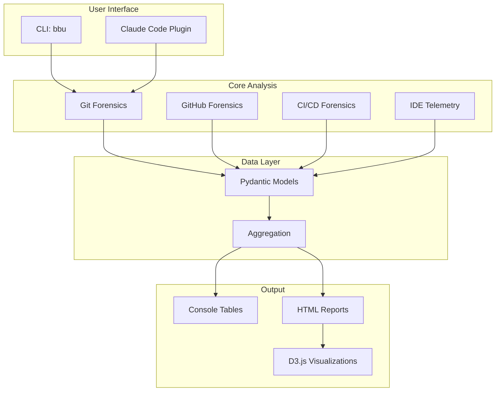
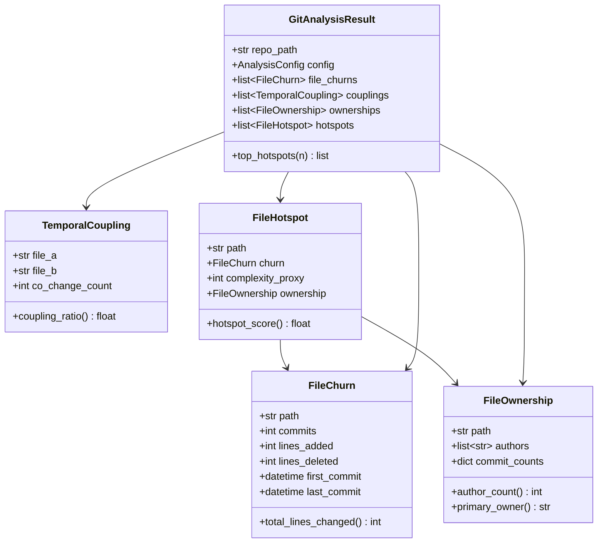
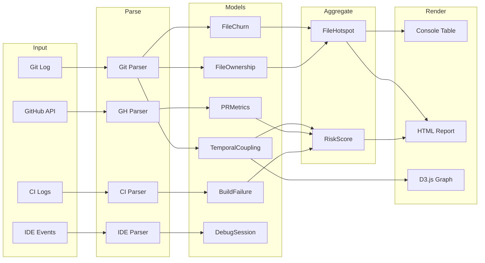

# Black Box Unlock - Architecture

> "Investigate your codebase like a crime scene"

Code forensics analysis tool based on Adam Tornhill's "Your Code as a Crime Scene". Key insight: **2-8% of files cause 60-90% of defects**.

## System Overview



## Module Organization

```
src/black_box_unlock/
├── __init__.py
├── cli.py                      # Typer CLI entry point
│
├── core/                       # Domain models and interfaces
│   ├── models.py               # Pydantic data models
│   ├── protocols.py            # Abstract interfaces (Protocols)
│   └── exceptions.py           # Custom exceptions
│
├── git/                        # Git history analysis
│   ├── analyzer.py             # GitAnalyzer orchestrator
│   ├── churn.py                # File churn extraction
│   ├── coupling.py             # Temporal coupling detection
│   ├── ownership.py            # Ownership spread calculation
│   └── parser.py               # Git log parsing utilities
│
├── github/                     # GitHub PR/Issue forensics
│   ├── analyzer.py             # GitHubAnalyzer orchestrator
│   ├── pr_metrics.py           # PR cycle time, reverts
│   ├── labels.py               # Label extraction
│   └── client.py               # Lazy gh CLI wrapper
│
├── cicd/                       # CI/CD metrics forensics
│   ├── analyzer.py             # CICDAnalyzer orchestrator
│   ├── builds.py               # Build failure tracking
│   ├── tests.py                # Flaky test detection
│   ├── deploys.py              # Rollback tracking
│   └── parsers/
│       └── github_actions.py   # GitHub Actions parser
│
├── ide/                        # IDE telemetry (opt-in)
│   ├── analyzer.py             # IDEAnalyzer orchestrator
│   ├── debug.py                # Debug session frequency
│   ├── time_tracking.py        # Time spent per file
│   └── navigation.py           # File navigation patterns
│
├── visualization/              # Output rendering
│   ├── renderer.py             # Format dispatch
│   ├── console.py              # Rich console output
│   ├── html.py                 # HTML/D3.js reports
│   └── data/                   # D3.js templates
│       ├── heatmap.html
│       └── coupling_graph.html
│
├── aggregation/                # Cross-domain scoring
│   ├── hotspots.py             # churn × complexity
│   └── risk_score.py           # Multi-signal scoring
│
└── mcp/                        # MCP lazy-loading
    └── registry.py             # Lazy client registry
```

## Core Data Models

All forensic findings use Pydantic models in `core/models.py`:



## Forensic Signals

| Signal | Source | Meaning |
|--------|--------|---------|
| **Churn** | Git | Commits per file = instability |
| **Temporal Coupling** | Git | Co-changing files >30% = hidden dependency |
| **Ownership Spread** | Git | >3 authors + high churn = coordination risk |
| **Hotspot Score** | Git | churn × log(complexity) |
| **Reverts** | GitHub | PRs reverting others = production failures |
| **Cycle Time** | GitHub | PR open→merge = friction indicator |
| **Review Comments** | GitHub | High density = complex/unclear code |
| **Build Failures** | CI/CD | Files in failing commits = fragile code |
| **Flaky Tests** | CI/CD | Intermittent failures = unreliable coverage |
| **Rollbacks** | CI/CD | Deploy reversals = risky changes |
| **Debug Sessions** | IDE | Frequent debugging = hard-to-understand code |
| **Navigation Jumps** | IDE | File→file patterns = hidden coupling |

## Design Principles

| Principle | Implementation |
|-----------|----------------|
| **TDD-first** | Tests written before implementation |
| **Lazy MCP Loading** | Clients initialized only when used |
| **CLI Fallback** | `gh` CLI when GitHub MCP unavailable |
| **Protocols over ABCs** | Duck typing for easier testing |
| **Pydantic Models** | Type-safe data with validation |
| **Generator Parsing** | Memory efficient for large repos |

## Test Structure

```
tests/
├── conftest.py                 # Shared fixtures (git repos)
├── unit/                       # Fast isolated tests
│   ├── core/
│   │   └── test_models.py
│   ├── git/
│   │   ├── test_churn.py
│   │   ├── test_coupling.py
│   │   └── test_ownership.py
│   └── visualization/
│       └── test_console.py
├── integration/                # Tests with real git
│   ├── test_git_analyzer.py
│   └── test_cli.py
└── fixtures/
    └── sample_git_log.txt
```

## Implementation Roadmap

### Phase 1: Git History Analysis (Epic BBU-t40)

Core forensic signals from git history.

| Task | ID | Description |
|------|----|-------------|
| File Churn | BBU-8b03 | Extract commits/lines per file |
| Temporal Coupling | BBU-f3v2 | Detect co-changing files |
| Ownership Spread | BBU-k4e2 | Calculate authors per file |
| CLI Command | BBU-pj6f | `bbu analyze-repo` |

### Phase 2: Visualizations (Epic BBU-vk7d)

Interactive visualizations for analysis results.

| Task | ID | Description |
|------|----|-------------|
| Hotspot Heatmap | BBU-6335 | Visual heatmap by issue count |
| Coupling Graph | BBU-ex2p | Force-directed network graph |
| Decision Timeline | BBU-lee4 | Timeline of architectural decisions |

### Phase 3: GitHub Forensics (Epic BBU-mijf)

PR metadata and issue labels via gh CLI.

| Task | ID | Description |
|------|----|-------------|
| Revert Detection | BBU-4509 | Flag unstable changes |
| PR Labels | BBU-wpuw | Categorize work types |
| Cycle Time | BBU-ar6l | PR open→merge duration |
| Review Comments | BBU-r8vd | Comment density per file |

### Phase 4: CI/CD Forensics (Epic BBU-odnx)

Build and deployment signals.

| Task | ID | Description |
|------|----|-------------|
| Build Failures | BBU-b7oh | Track failures per file |
| Flaky Tests | BBU-pvcw | Detect intermittent failures |
| Rollback Rate | BBU-a087 | Track deploy reversals |
| Deploy Frequency | BBU-x3h0 | Calculate per component |

### Phase 5: IDE Telemetry (Epic BBU-wzts)

Developer behavior signals (opt-in only).

| Task | ID | Description |
|------|----|-------------|
| Debug Sessions | BBU-12d6 | Frequency per file |
| Time Tracking | BBU-2aj8 | Active editing time |
| Navigation | BBU-l4qu | File→file jumps |
| Search Patterns | BBU-p5xj | Find-in-files usage |

## Data Flow



## Dependencies

```toml
# pyproject.toml
dependencies = [
    "typer>=0.9.0",      # CLI framework
    "rich>=13.0.0",      # Terminal output
    "pydantic>=2.0.0",   # Data models
    "jinja2>=3.0.0",     # HTML templates
]
```

## CLI Commands

```bash
# Analyze repository
bbu analyze-repo --days=30        # Last 30 days
bbu analyze-repo --hotspots       # Show hotspots only
bbu analyze-repo --coupling       # Show temporal coupling
bbu analyze-repo --output=html    # Generate HTML report

# Show version
bbu version
```

## Related Documentation

- [CLAUDE.md](CLAUDE.md) - Project instructions and quick reference
- [.beads/](/.beads/) - Issue tracking for multi-session work
- [.claude-plugin/](.claude-plugin/) - Claude Code plugin commands
