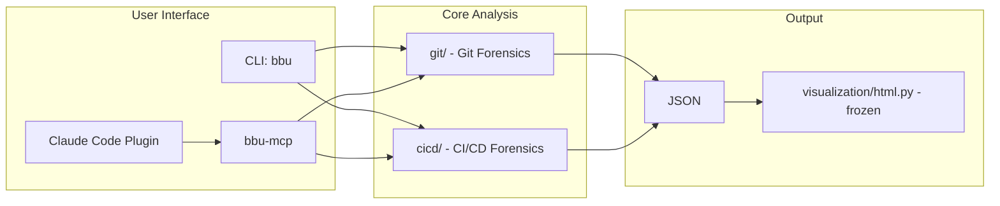

# Black Box Unlock - Project Instructions

## Core Concept

**"Investigate your codebase like a crime scene"**

Based on Adam Tornhill's "Your Code as a Crime Scene" - using forensic techniques to identify problematic code areas. Key insight: **2-8% of files cause 60-90% of defects**.

## Architecture

See [docs/ARCHITECTURE.md](docs/ARCHITECTURE.md) for full details including module organization, data models, and implementation roadmap. See [docs/CODEMAP.md](docs/CODEMAP.md) for bidirectional navigation between architecture and source code.



## Key Design Decisions

| Decision | Rationale |
|----------|-----------|
| **Lazy-load MCPs** | MCP clients only initialized when first used |
| **Sub-agents over monolith** | Specialized agents for each forensic type |
| **CLI fallback** | `gh` CLI when GitHub MCP unavailable |
| **Agent-first** | MCP server (bbu-mcp) + plugin are the primary interface; HTML report is frozen |
| **TDD throughout** | Every feature starts with tests |

## Key Files

| Path | Purpose |
|------|---------|
| `docs/ARCHITECTURE.md` | Full architecture, data models, roadmap |
| `docs/CODEMAP.md` | Bidirectional code map with `[ID]` annotations |
| `.claude-plugin/` | Plugin manifest + self-hosted marketplace (components live at repo root: `commands/`, `agents/`, `hooks/`, `.mcp.json`) |
| `src/black_box_unlock/cli.py` | CLI commands (`bbu`) |
| `src/black_box_unlock/mcp_server.py` | bbu-mcp MCP server (six read tools) |
| `src/black_box_unlock/guard.py` | Coupling guard backing the edit hook |
| `src/black_box_unlock/core/` | Pydantic models, exceptions, logging |
| `src/black_box_unlock/git/` | Git forensics (churn, coupling, ownership, defects, log) |
| `src/black_box_unlock/cicd/` | CI/CD forensics (build failures, flaky steps via gh CLI) |
| `src/black_box_unlock/visualization/` | HTML report, treemap, coupling graph (frozen) |
| `tests/` | TDD test suite |
| `.beads/` | Issue tracking for multi-session work |

## Forensic Signals

### Git History
- **Churn**: Files with many commits = instability
- **Temporal coupling**: Files changing together >30% = hidden dependencies
- **Ownership spread**: >3 authors + high churn = coordination risk
- **Hotspot score**: commits × indentation complexity
- **Bug-fix density**: defect-repair commits per file (fix/bug/hotfix/defect/regression/revert markers, excluding docs/style/test/chore-prefixed commits)

### CI/CD
- **Build failures**: Files that break builds = fragile code
- **Flaky steps**: CI steps that failed then passed on re-run = unreliable coverage

## CLI Commands

```bash
bbu analyze-repo --days=30    # Analyze git history
bbu analyze-repo --no-ci      # Skip CI failure analysis
bbu analyze-repo --output=html  # Generate HTML report
bbu analyze-repo --min-coupling=0.5  # Set coupling threshold
bbu analyze-repo --repo /path/to/repo  # Analyze another repository
bbu coupling-guard FILE       # Hook helper: warn if FILE has strong temporal couples
bbu version                   # Show version
```

## Development Workflow

### Finding Work
- `bd ready` - tasks with no blockers
- `bd show <id>` - review issue details
- `bd update <id> --status=in_progress` - claim work

### Planning
- Invoke `brainstorming` skill before creative/feature work
- Invoke `writing-plans` skill for multi-step implementation

### Implementation
- Invoke `test-driven-development` skill - write tests first
- Invoke `systematic-debugging` skill when bugs arise
- `uv run pytest -v` - run tests
- `uv run ruff check . && uv run ruff format .` - lint and format

### Completion
- Run `code-simplifier:code-simplifier` agent on changed files before commit
- Update `CHANGELOG.md` with new features/fixes before closing issues
- Invoke `verification-before-completion` skill before claiming done
- Invoke `requesting-code-review` skill after major features
- Invoke `/codemap` skill when architecture changes significantly
- `bd close <id>` - mark issue complete
- `bd sync` - push to remote
- Update README.md if new features

## Gotchas

- **Pytest markers for external CLIs**: Use `@pytest.mark.requires_<tool>` (e.g., `requires_gh`) for tests needing external CLI tools - skipped automatically via `conftest.py` when tool unavailable
- **CI data is optional**: `_fetch_ci_failures()` catches all exceptions and returns `{}` - analysis continues without CI data
- **Git commands**: Always handle missing git repos gracefully; avoid `git show --no-stat` (invalid flag)
- **File paths**: Normalize paths for cross-platform compatibility
- **Rich console.print() strips brackets**: Use `print()` for HTML output - Rich interprets `[text]` as markup tags
- **Plotly/Cytoscape hidden containers**: Can't render to `display: none` - defer init until tab visible
- **Plotly treemap duplicate labels**: Use unique `ids` (full paths) when labels repeat across directories
