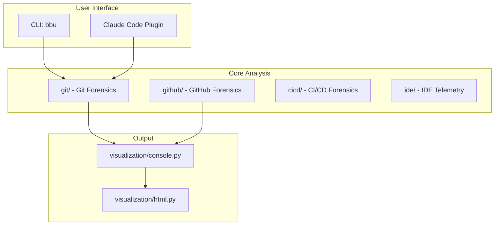

# Black Box Unlock - Project Instructions

## Core Concept

**"Investigate your codebase like a crime scene"**

Based on Adam Tornhill's "Your Code as a Crime Scene" - using forensic techniques to identify problematic code areas. Key insight: **2-8% of files cause 60-90% of defects**.

## Architecture

See [ARCHITECTURE.md](ARCHITECTURE.md) for full details including module organization, data models, and implementation roadmap.



## Key Design Decisions

| Decision | Rationale |
|----------|-----------|
| **Lazy-load MCPs** | MCP clients only initialized when first used |
| **Sub-agents over monolith** | Specialized agents for each forensic type |
| **CLI fallback** | `gh` CLI when GitHub MCP unavailable |
| **Plugin-first** | Claude Code plugin is the primary interface |
| **TDD throughout** | Every feature starts with tests |

## Key Files

| Path | Purpose |
|------|---------|
| `ARCHITECTURE.md` | Full architecture, data models, roadmap |
| `.claude-plugin/` | Claude Code plugin (commands, agents) |
| `src/black_box_unlock/cli.py` | CLI commands (`bbu`) |
| `src/black_box_unlock/core/` | Pydantic models, protocols, exceptions |
| `src/black_box_unlock/git/` | Git forensics (churn, coupling, ownership) |
| `tests/` | TDD test suite |
| `.beads/` | Issue tracking for multi-session work |

## Forensic Signals

### Git History
- **Churn**: Files with many commits = instability
- **Temporal coupling**: Files changing together >30% = hidden dependencies
- **Ownership spread**: >3 authors + high churn = coordination risk
- **Hotspot score**: churn × complexity

### GitHub (via lazy MCP)
- **PR labels**: `bug`, `tech-debt` = work type distribution
- **Cycle time**: Slow PRs often touch brittle code
- **Reverts**: Files in reverts = high risk
- **Review comments**: Heavily-discussed files need attention

### CI/CD
- **Build failures**: Files that break builds = fragile code
- **Flaky tests**: Intermittent failures = unreliable coverage
- **Rollbacks**: Deploys rolled back = risky changes

## CLI Commands

```bash
bbu analyze-repo --days=30    # Analyze git history
bbu analyze-repo --hotspots   # Show file hotspots
bbu version                   # Show version
```

## Testing

```bash
uv run pytest -v              # All tests
uv run ruff check .           # Lint
uv run ruff format .          # Format
```

## Development Workflow

1. Check `bd ready` for available work
2. Start with tests (TDD)
3. Implement feature
4. Run tests and lint
5. Close beads issue with `bd close <id>`
6. Sync with `bd sync`

## Gotchas

- **Lazy-load MCPs**: Never initialize MCP clients at module import
- **Git commands**: Always handle missing git repos gracefully
- **File paths**: Normalize paths for cross-platform compatibility
