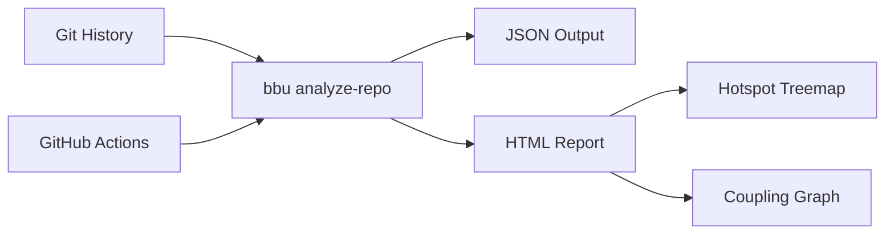

<table width="100%">
<tr>
<td width="250">

</td>
<td valign="middle">

[](https://github.com/michael-denyer/black-box-unlock/actions/workflows/ci.yml)
[](https://opensource.org/licenses/MIT)
[](https://www.python.org/downloads/)
[](https://github.com/astral-sh/ruff)

# Black Box Unlock

*Mischief. Mayhem. Merge conflicts. Exposed.*

Code forensics tool based on Adam Tornhill's ["Your Code as a Crime Scene"](https://pragprog.com/titles/atcrime2/your-code-as-a-crime-scene-second-edition/).

Key insight: **2-8% of files cause 60-90% of defects**.
</td>
</tr>
</table>


## Installation

```bash
uv pip install -e .
```

CI failure analysis additionally uses the [gh](https://cli.github.com/) CLI when available (skip with `--no-ci`).

## Usage

```bash
# Analyze last 30 days of git history, output JSON
bbu analyze-repo --days=30

# Generate interactive HTML report
bbu analyze-repo --days=30 --output=html > report.html

# Adjust coupling detection threshold (default 0.3)
bbu analyze-repo --min-coupling=0.5 --output=html > report.html

# Skip CI failure analysis (faster, no GitHub access needed)
bbu analyze-repo --no-ci --output=html > report.html
```

## Features

| Signal | Description |
|--------|-------------|
| **Hotspot Score** | commits × indentation complexity - identifies unstable complex code |
| **Temporal Coupling** | Files changing together >30% reveal hidden dependencies |
| **Ownership Risk** | >3 authors + high churn = coordination problems |
| **Build Failures** | Files appearing in CI failures = fragile code |
| **Bug-fix Density** | Count of defect-repair commits per file |
| **Flaky Steps** | CI steps that failed then passed on re-run |

### HTML Report

The HTML report includes three interactive views:

- **Table** - Sortable file metrics with severity coloring
- **Hotspots** - Plotly treemap showing file churn by directory
- **Coupling** - Cytoscape.js network graph of temporal coupling



## Architecture

See [docs/ARCHITECTURE.md](docs/ARCHITECTURE.md) for full details.

```
src/black_box_unlock/
├── cli.py              # Typer CLI
├── complexity.py       # Indentation-depth complexity proxy
├── analysis.py         # Orchestration
├── core/               # Pydantic models, exceptions, logging
├── git/                # Churn, coupling, ownership, defects, log extraction
├── cicd/               # CI/CD forensics (build failures, flaky steps via gh CLI)
└── visualization/      # HTML, treemap, coupling graph (frozen)
```

## Development

```bash
# Run tests
uv run pytest -v

# Lint and format
uv run ruff check . && uv run ruff format .

# Verbose output for debugging
bbu --verbose analyze-repo
```

## License

MIT
