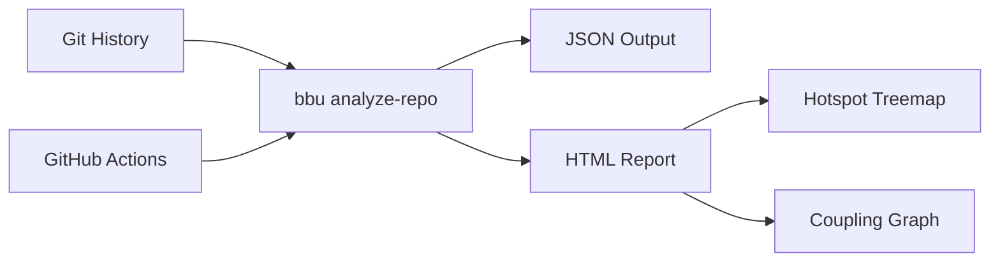

<table width="100%">
<tr>
<td width="250">

</td>
<td valign="middle">

[](https://github.com/michael-denyer/black-box-unlock/actions/workflows/ci.yml)
[](https://opensource.org/licenses/MIT)
[](https://www.python.org/downloads/)
[](https://github.com/astral-sh/ruff)

# Black Box Unlock

*Mischief. Mayhem. Merge conflicts. Exposed.*

Code forensics tool based on Adam Tornhill's ["Your Code as a Crime Scene"](https://pragprog.com/titles/atcrime2/your-code-as-a-crime-scene-second-edition/).

Key insight: **2-8% of files cause 60-90% of defects**. Built for AI coding agents: forensic signals as MCP tools and a Claude Code plugin, so reviews and refactors are prioritized by evidence.
</td>
</tr>
</table>


## For agents (MCP + plugin)

```bash
uv tool install black-box-unlock   # provides bbu and bbu-mcp
```

Register the MCP server in Claude Code (`.mcp.json`):

```json
{ "mcpServers": { "black-box-unlock": { "command": "bbu-mcp" } } }
```

Tools: `get_hotspots`, `get_file_forensics`, `get_coupled_files`,
`get_ownership`, `get_ci_failures`, `get_flaky_steps`, `xray_file`.

The Claude Code plugin in this repo adds `/analyze`, `/hotspots`, a
`git-forensics` agent, and an ambient coupling guard that warns when you
edit one half of a temporally coupled file pair. Install it via the
self-hosted marketplace:

```text
/plugin marketplace add michael-denyer/black-box-unlock
/plugin install black-box-unlock@black-box-unlock
```

Both `bbu` and `bbu-mcp` must be on PATH for the plugin and MCP server
to work.

## CLI

### Installation

```bash
uv pip install -e .
```

CI failure analysis additionally uses the [gh](https://cli.github.com/) CLI when available (skip with `--no-ci`).

### Usage

```bash
# Analyze last 30 days of git history, output JSON
bbu analyze-repo --days=30

# Generate interactive HTML report
bbu analyze-repo --days=30 --output=html > report.html

# Adjust coupling detection threshold (default 0.3)
bbu analyze-repo --min-coupling=0.5 --output=html > report.html

# Skip CI failure analysis (faster, no GitHub access needed)
bbu analyze-repo --no-ci --output=html > report.html

# Analyze a different repository
bbu analyze-repo --repo /path/to/repo --output=html > report.html

# Per-function churn for one file (Tornhill's X-Ray)
bbu xray src/hot_file.py --days 365
```

### Features

| Signal | Description |
|--------|-------------|
| **Hotspot Score** | commits × indentation complexity - identifies unstable complex code |
| **Temporal Coupling** | Files changing together >30% reveal hidden dependencies |
| **Ownership Risk** | >3 authors + high churn = coordination problems |
| **Build Failures** | Files appearing in CI failures = fragile code |
| **Bug-fix Density** | Count of defect-repair commits per file |
| **Flaky Steps** | CI steps that failed then passed on re-run |
| **Function X-Ray** | Per-function churn × complexity for hot files ([docs/XRAY.md](docs/XRAY.md)) |

## Does the ranking actually predict bugs?

Measured with `bbu validate` (split-history: rank hotspots on the older half,
count bug-fix commits in the newer half): median Spearman rho **0.46** across
six real repos (click, flask, pydantic, rich, fastapi, httpx); the top 10% of
ranked files attracted a median **46%** of subsequent bug-fix touches — uniform
would be 10%. Method, per-repo numbers, and limitations:
[docs/VALIDATION.md](docs/VALIDATION.md).

```bash
bbu validate --repo /path/to/repo --days 730
```

## HTML report

The HTML report includes three interactive views:

- **Table** - Sortable file metrics with severity coloring
- **Hotspots** - Plotly treemap showing file churn by directory
- **Coupling** - Cytoscape.js network graph of temporal coupling

The HTML report is feature-frozen; new signals land in JSON and MCP only.



## Architecture

See [docs/ARCHITECTURE.md](docs/ARCHITECTURE.md) for full details.

```
src/black_box_unlock/
├── cli.py              # Typer CLI
├── complexity.py       # Indentation-depth complexity proxy
├── analysis.py         # Orchestration
├── core/               # Pydantic models, exceptions, logging
├── git/                # Churn, coupling, ownership, defects, log extraction
├── cicd/               # CI/CD forensics (build failures, flaky steps via gh CLI)
└── visualization/      # HTML, treemap, coupling graph (frozen)
```

## Development

```bash
# Run tests
uv run pytest -v

# Lint and format
uv run ruff check . && uv run ruff format .

# Verbose output for debugging
bbu --verbose analyze-repo
```

## License

MIT
