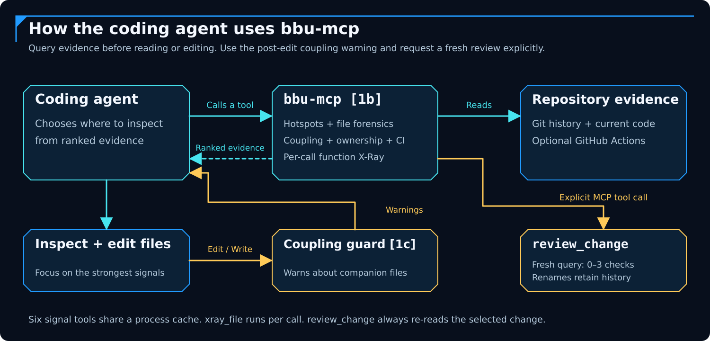
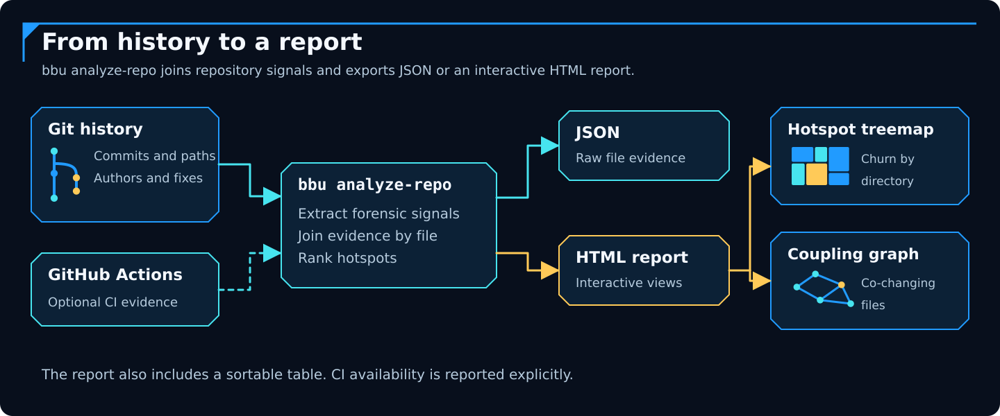

<table width="100%">
<tr>
<td width="250">

</td>
<td valign="middle">

[](https://github.com/michael-denyer/black-box-unlock/actions/workflows/ci.yml)
[](https://spdx.org/licenses/MIT.html)
[](https://www.python.org/downloads/)
[](https://github.com/astral-sh/ruff)

# Black Box Unlock

*Mischief. Mayhem. Merge conflicts. Exposed.*

Code forensics tool based on Adam Tornhill's ["Your Code as a Crime Scene"](https://pragprog.com/titles/atcrime2/your-code-as-a-crime-scene-second-edition/).

The useful bit from code-forensics research is concentration: **2-8% of files
cause 60-90% of defects**. Black Box Unlock gives AI coding agents those
signals through MCP tools and a Claude Code plugin.
</td>
</tr>
</table>

## How it works

Coding agents ask `bbu-mcp` for forensic evidence before they inspect or edit
code. Ranked hotspots and coupled files guide their focus, the edit hook warns
about companion files, and a fresh change review returns up to three checks.


## For agents (MCP + plugin)

The agent calls `bbu-mcp` before it reads or edits code, and uses the ranked
evidence to decide which files to inspect first.



```bash
uv tool install black-box-unlock   # provides bbu and bbu-mcp
```

Register the MCP server in Claude Code (`.mcp.json`):

```json
{ "mcpServers": { "black-box-unlock": { "command": "bbu-mcp" } } }
```

Tools: `get_hotspots`, `get_file_forensics`, `get_coupled_files`,
`get_ownership`, `get_ci_failures`, `get_flaky_steps`, `xray_file`,
`review_change`.
Each file carries a `path_role` (`source`, `test`, `docs`, and so on), and
`get_hotspots` accepts `roles` to keep only those roles, for example
`roles=["source"]` to drop tests from the ranking. See
[Path roles](docs/CONFIGURATION.md#path-roles).
The CI tools return `status` and `errors`, so a missing or partial GitHub
response cannot look like a clean result. Failed-run data includes the workflow,
run URL, commit, time, and paths changed in that commit. Those paths are
implicated by the failed run, not proven to have caused it.

The Claude Code plugin in this repo adds `/review-change`, `/analyze`, `/hotspots`, a
`git-forensics` agent, and an ambient coupling guard that warns when you
edit one half of a repeatedly coupled file pair. The hook parses Claude's JSON
directly and does not require `jq`. Install it via the
self-hosted marketplace:

```text
/plugin marketplace add michael-denyer/black-box-unlock
/plugin install black-box-unlock@black-box-unlock
```

Both `bbu` and `bbu-mcp` must be on PATH for the plugin and MCP server
to work.

## CLI

### Installation

```bash
uv pip install -e .
```

`analyze-repo` uses the [gh](https://cli.github.com/) CLI for CI data by
default; pass `--no-ci` to skip it. `review-change` queries GitHub only when a
profile or `--include-ci` turns that signal on.

### Usage

```bash
# Analyze last 30 days of git history, output JSON
bbu analyze-repo --days=30

# Generate interactive HTML report
bbu analyze-repo --days=30 --output=html > report.html

# Adjust the coupling policy (defaults 0.3, 2, and 50)
bbu analyze-repo --min-coupling=0.5 --min-shared-revisions=3 --max-changeset-size=80

# Skip CI failure analysis (faster, no GitHub access needed)
bbu analyze-repo --no-ci --output=html > report.html

# Analyze a different repository
bbu analyze-repo --repo /path/to/repo --output=html > report.html

# Per-function churn for one file (Tornhill's X-Ray)
bbu xray src/hot_file.py --days 365

# Review branch commits and local work from the upstream merge base
bbu review-change --base origin/main

# Review only staged work, or only unstaged and untracked work
bbu review-change --staged
bbu review-change --working-tree

# Use a named .bbu.toml profile and retain failed workflow details
bbu review-change --profile release

# Diagnose local activation (CI and gh remain optional)
bbu doctor
```

### Project configuration

Add `.bbu.toml` when the built-in path roles or review defaults do not fit the
repository:

```toml
default_profile = "release"

[coupling]
min_ratio = 0.3
min_shared_revisions = 2
max_changeset_size = 50
require_live_partner = true

[[path_roles]]
pattern = "app/**/*.vue"
role = "source"

[[path_roles]]
pattern = "snapshots/**"
role = "generated"

[profiles.release]
days = 180
min_coupling = 0.4
min_shared_revisions = 3
include_ci = true
max_actions = 3
```

The `[coupling]` table sets one coupling policy for `analyze-repo`, the MCP
tools, the edit hook, and review. Project path rules run in file order before
the built-in rules. Named profiles
set review defaults; command-line and MCP arguments override the selected
profile. Invalid configuration stops the review with a clear error. The full
format and glob rules are in
[docs/CONFIGURATION.md](docs/CONFIGURATION.md).

### Features

| Signal | Description |
|--------|-------------|
| **Hotspot Score** | commits × indentation complexity - identifies unstable complex code |
| **Temporal Coupling** | Files changing together in at least two commits reveal hidden dependencies. Each pair reports the symmetric ratio and both directional rates. The edit hook and review warn from the edited file's rate, so editing a hub stays quiet about leaves. Repeated evidence ranks by a 95% Wilson lower bound, and partners deleted at HEAD are dropped |
| **Rename Following** | History recorded under an older name follows git's rename detection to the current path, so hotspots, coupling, ownership, bug-fix counts, the edit hook, and X-Ray keep a renamed file's past. `renamed_from` lists the older names |
| **Bulk Commits** | Commits touching more than 50 files are excluded from churn, ownership, bug-fix, and coupling counts and reported as `ignored_large_changesets` |
| **Change Review** | A fresh branch, staged, or working-tree review returns at most three typed actions with raw evidence |
| **Ownership Risk** | More than three authors with no one holding half the commits is diffuse, a coordination risk. More than three authors with one at 50% or more of non-bot commits is shared. Each file reports `main_author`, `main_author_share`, and `last_active` |
| **Build Failures** | Failed workflow links and files changed in each failed commit, reported as implication rather than causation |
| **Bug-fix Density** | Count of defect-repair commits per file |
| **Flaky Steps** | CI steps that failed then passed on re-run |
| **Function X-Ray** | Per-function churn × complexity for hot files ([docs/XRAY.md](docs/XRAY.md)) |

## Does the ranking actually predict bugs?

Measured with `bbu validate` (split-history: rank the files that existed at a
cutoff commit using only history up to it, then count bug-fix commits after
it, beside churn-only, file-length, and seeded random baselines). On this
repository at `--days 365` the hotspot top 10% took **30%** of subsequent
bug-fix touches against a random mean of 10% (permutation p = 0.010), the
same share as churn alone, while file length beat both on rank correlation.
Method, the run, and limitations:
[docs/VALIDATION.md](docs/VALIDATION.md).

```bash
bbu validate --repo /path/to/repo --days 730
```

## HTML report

The HTML output is a self-contained investigation workspace:

- **Files** - searchable, sortable metrics with a persistent evidence panel
- **Risk matrix and change landscape** - two routes into the same selected file
- **Coupling evidence** - confidence-first pairs with support and denominators
- **CI and signals** - collection status, failed runs, flaky steps, and policy

The report opens in **Code only** scope: source files and migrations, with
coupling limited to pairs whose two endpoints are in that scope. Tests,
configuration, documentation, generated files, and repository metadata remain
available through the scope selector.

Numeric evidence columns use proportional heat bars scaled to the current
scope. The change landscape groups files by code area without repeating
low-information repository path levels.

Pinned ECharts and Tabulator assets are embedded in the document, so opening a
saved report makes no CDN requests. Charts are supplementary: the evidence
needed to interpret them remains in keyboard-operable grids and text panels.



## Architecture

See [docs/ARCHITECTURE.md](docs/ARCHITECTURE.md) for full details.

```text
src/black_box_unlock/
├── cli.py              # Typer CLI
├── complexity.py       # Indentation-depth complexity proxy
├── analysis.py         # Orchestration
├── core/               # Pydantic models, exceptions, logging
├── git/                # Churn, coupling, ownership, defects, log extraction
├── cicd/               # CI/CD forensics (build failures, flaky steps via gh CLI)
└── visualization/      # Offline HTML investigation workspace
```

## Development

```bash
# Install development dependencies and the Git hook
uv sync --all-extras --dev
uv run prek install

# Run the same quality and security checks as CI
uv run prek run --all-files

# Run tests
uv run pytest -v

# Verbose output for debugging
bbu --verbose analyze-repo
```

The `prek` gate covers repository hygiene, Ruff, Pyrefly, GitHub Actions
linting, Markdown and link checks, workflow security, and
locked-dependency auditing. Link and dependency checks need network access.

## License

MIT
