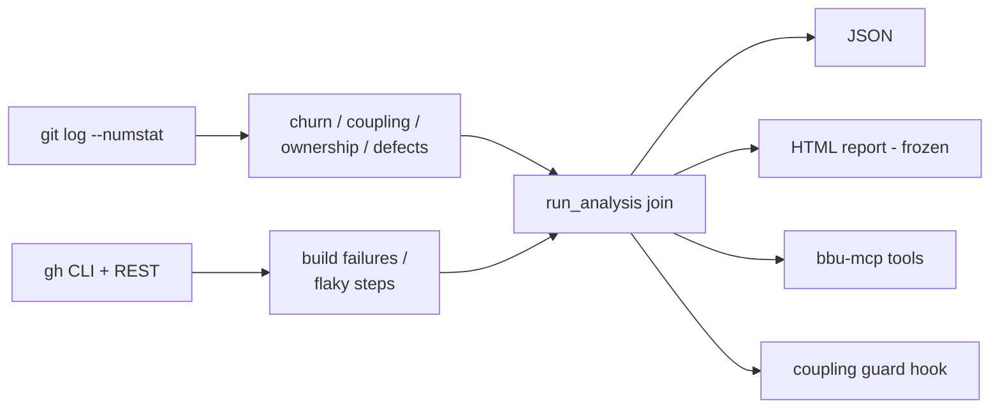

# Architecture

Code forensics tool based on Adam Tornhill's "Your Code as a Crime Scene".
Signals are extracted from git history and GitHub Actions, joined per file,
and served as JSON, an HTML report (frozen), MCP tools (`bbu-mcp`), and an
ambient coupling-guard hook for Claude Code.

## Module layout

```text
src/black_box_unlock/
├── cli.py                  # Typer CLI: bbu analyze-repo / version
├── complexity.py           # Indentation-depth complexity proxy
├── analysis.py             # Pipeline: fetch -> parse -> join -> AnalysisResult
├── mcp_server.py           # FastMCP server: bbu-mcp (six read tools, cached)
├── guard.py                # Coupling guard: cached analysis for the edit hook
├── core/
│   ├── models.py           # Pydantic models (FileForensics, AnalysisResult, ...)
│   ├── exceptions.py       # NotAGitRepoError, GitToolNotFoundError
│   └── logging.py          # loguru configuration (--verbose)
├── git/
│   ├── log.py              # Native git log --numstat extraction
│   ├── churn.py            # FileChurn aggregation
│   ├── coupling.py         # Temporal coupling (Tornhill ratio)
│   ├── ownership.py        # Authors per file
│   └── defects.py          # Bug-fix commit detection
├── cicd/
│   ├── models.py           # WorkflowRun, BuildFailure, FlakyStep
│   └── github_actions.py   # gh CLI fetchers, flaky detection
└── visualization/          # FROZEN - no new features
    ├── html.py             # Tabbed HTML report
    ├── treemap.py          # Plotly hotspot treemap
    └── coupling_graph.py   # Cytoscape coupling graph
```

## Signals

| Signal | Source | Formula |
|--------|--------|---------|
| Hotspot score | git + file contents | commits x indentation complexity (serialized-data/lockfile/generated-asset files and generator-marked files score 0; notebooks scored over code cells) |
| Temporal coupling | git | co_changes / min(commits_a, commits_b), threshold 0.3 |
| Ownership risk | git | > 3 authors |
| Bug-fix commits | git messages | fix(ing)/bug/hotfix/defect/regression/revert + repair verbs (correct/broke/crash/repair/fault/malfunction/stuck/hang) markers, excluding docs/style/test/chore/ci/build/refactor/feat-prefixed commits |
| Build failures | gh CLI | files changed in failing workflow runs |
| Flaky steps | gh api | step failed attempt N, passed attempt M>N (re-runs only) |

## Data flow



## Degraded modes

- Not a git repo -> `NotAGitRepoError`, CLI prints error, exit 1
- git missing -> `GitToolNotFoundError`, same handling
- gh missing/unauthenticated -> loguru warning, CI signals empty, analysis continues

## Roadmap

Tracked in the local issue tracker.
Decided direction: agent-native (MCP + plugin) on top of corrected signals; HTML frozen;
no IDE telemetry; no PR-flow dashboard signals.
