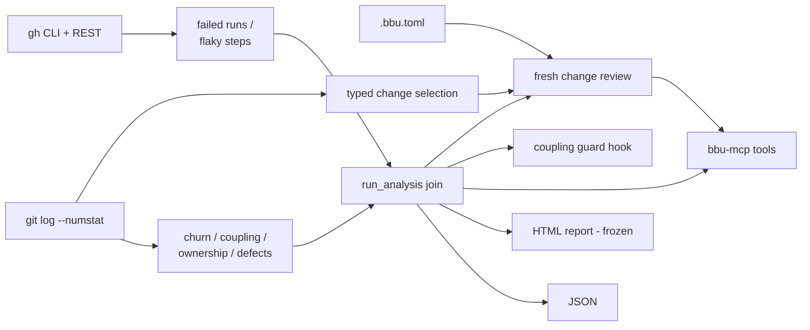

# Architecture

Code forensics tool based on Adam Tornhill's "Your Code as a Crime Scene".
Signals are extracted from git history and GitHub Actions, joined per file,
and served as JSON, an HTML report (frozen), MCP tools (`bbu-mcp`), a fresh
change-review decision, and an ambient coupling-guard hook for Claude Code.

## Module layout

```text
src/black_box_unlock/
├── cli.py                  # Typer CLI: bbu analyze-repo / version
├── complexity.py           # Indentation-depth complexity proxy
├── analysis.py             # Pipeline: fetch -> parse -> join -> AnalysisResult
├── mcp_server.py           # FastMCP server: cached signals + fresh review
├── review.py               # Pure review projection and bounded action policy
├── config.py               # .bbu.toml parsing and named profile resolution
├── path_roles.py           # Project and built-in path-role classifier
├── guard.py                # Coupling guard: small typed cache for the edit hook
├── core/
│   ├── models.py           # Pydantic models (FileForensics, AnalysisResult, ...)
│   ├── exceptions.py       # NotAGitRepoError, GitToolNotFoundError
│   └── logging.py          # loguru configuration (--verbose)
├── git/
│   ├── log.py              # Native git log --numstat extraction
│   ├── churn.py            # FileChurn aggregation
│   ├── coupling.py         # Temporal coupling (Tornhill ratio, bulk-commit cap)
│   ├── changes.py          # Base, staged, and working-tree selection
│   ├── ownership.py        # Authors per file
│   └── defects.py          # Bug-fix commit detection
├── cicd/
│   ├── models.py           # Typed workflow, job, step, and CI result models
│   └── github_actions.py   # One run snapshot, failure + flaky-step collection
└── visualization/          # FROZEN - no new features
    ├── html.py             # Tabbed HTML report
    ├── treemap.py          # Plotly hotspot treemap
    └── coupling_graph.py   # Cytoscape coupling graph
```

## Signals

| Signal | Source | Formula |
|--------|--------|---------|
| Hotspot score | git + file contents | commits x indentation complexity (serialized-data/lockfile/generated-asset files and generator-marked files score 0; notebooks scored over code cells) |
| Temporal coupling | git | co_changes / min(commits_a, commits_b), ordered by 95% Wilson lower bound; commits touching >50 files are excluded from pair generation |
| Ownership risk | git | > 3 authors |
| Bug-fix commits | git messages | fix(ing)/bug/hotfix/defect/regression/revert + repair verbs (correct/broke/crash/repair/fault/malfunction/stuck/hang) markers, excluding docs/style/test/chore/ci/build/refactor/feat-prefixed commits |
| Build failures | gh CLI | failed workflow details plus paths changed in each failed commit; implication, not causality |
| Flaky steps | gh api | step failed attempt N, passed attempt M>N (re-runs only) |

## Data flow


```mermaid
flowchart LR
    Git[git log --numstat] --> Parse[churn / coupling /<br/>ownership / defects]
    GH[gh CLI + REST] --> CI[failed runs /<br/>flaky steps]
    Config[.bbu.toml] --> Review
    Parse --> Join[run_analysis join]
    CI --> Join
    Join --> JSON[JSON]
    Join --> HTML[HTML report - frozen]
    Join --> MCP[bbu-mcp tools]
    Join --> Guard[coupling guard hook]
    Git --> Change[typed change selection]
    Change --> Review[fresh change review]
    Join --> Review
    Review --> MCP
```

## Degraded modes

- Not a git repo -> `NotAGitRepoError`, CLI prints error, exit 1
- git missing -> `GitToolNotFoundError`, same handling
- gh missing/unauthenticated -> `ci_status.state` is `unavailable`, errors are reported, analysis continues
- one failed CI detail request -> `ci_status.state` is `partial`; successful run data is preserved
- missing review base -> `InvalidRevisionError`, CLI prints a clean error
- unresolved merge conflict -> `ChangeSelectionError`; no misleading actions are returned
- invalid `.bbu.toml` or unknown profile -> `ConfigurationError`; no review runs

## Product constraints

The product stays agent-native through MCP and the plugin. HTML is frozen.
There is no IDE telemetry, PR-flow dashboard, or composite risk score.
