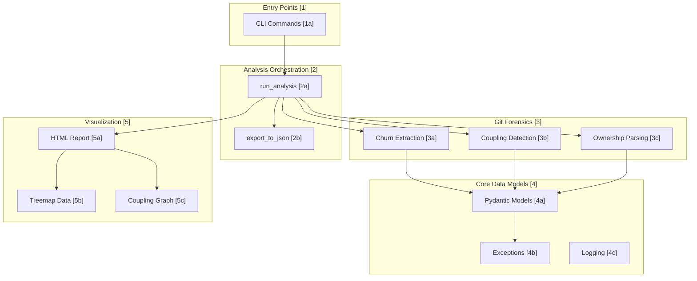
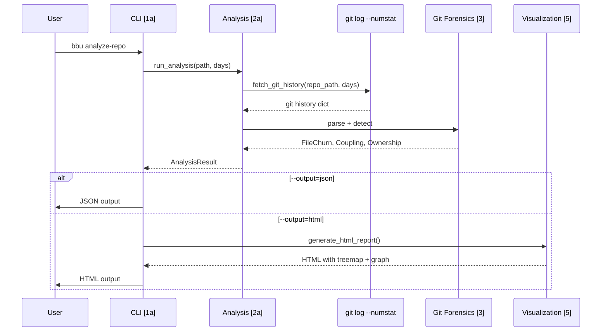
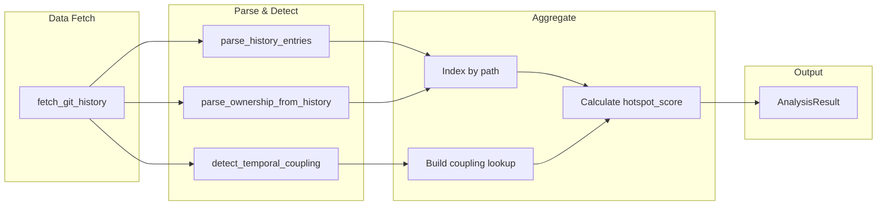
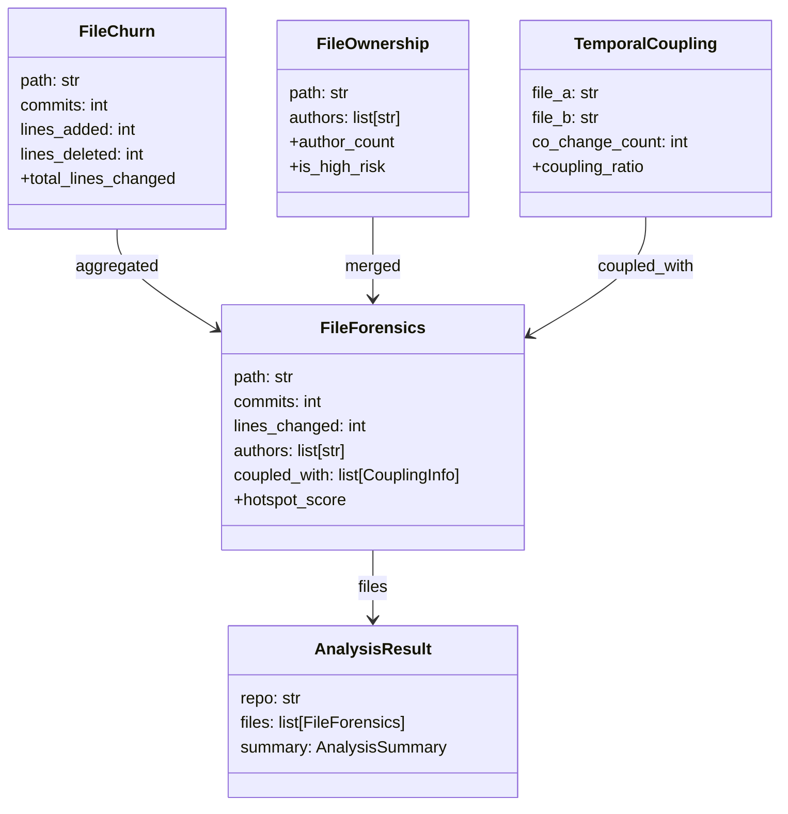
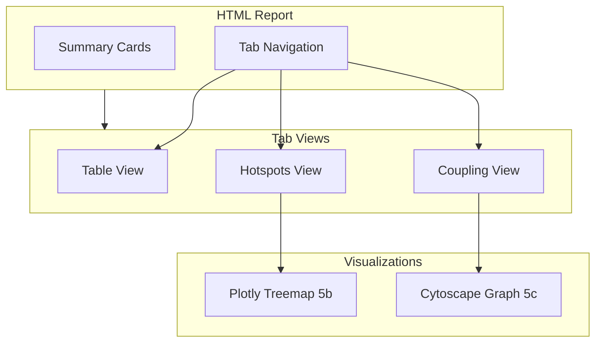

# Black Box Unlock - Code Map

> Bidirectional navigation between architecture diagrams and source code

## System Overview



## Data Flow



---

### [1] Entry Points (CLI)

User-facing commands via Typer CLI.

| ID | Component | Description | File:Line |
|----|-----------|-------------|-----------|
| 1a | CLI App | Typer application with `bbu` command | [cli.py:34](../src/black_box_unlock/cli.py#L34) |
| 1a.1 | analyze_repo | Main analysis command | [cli.py:49](../src/black_box_unlock/cli.py#L49) |
| 1a.2 | version | Version info command | [cli.py:78](../src/black_box_unlock/cli.py#L78) |

---

### [2] Analysis Orchestration

Orchestrates forensic analysis by combining data from multiple sources.

| ID | Component | Description | File:Line |
|----|-----------|-------------|-----------|
| 2a | run_analysis | Main analysis pipeline | [analysis.py:78](../src/black_box_unlock/analysis.py#L78) |
| 2a.1 | _fetch_ci_failures | Fetch CI failure counts per file | [analysis.py:31](../src/black_box_unlock/analysis.py#L31) |
| 2a.2 | _fetch_flaky_steps | Fetch flaky CI step summaries | [analysis.py:49](../src/black_box_unlock/analysis.py#L49) |
| 2b | export_to_json | Serialize result to JSON | [analysis.py:174](../src/black_box_unlock/analysis.py#L174) |

#### Analysis Pipeline [2a]



---

### [3] Git Forensics

Domain logic for extracting forensic signals from git history.

| ID | Component | Description | File:Line |
|----|-----------|-------------|-----------|
| 3a | parse_history_entries | Parse git log dict to FileChurn list | [churn.py:12](../src/black_box_unlock/git/churn.py#L12) |
| 3a.1 | extract_file_churn | Extract churn from git repo | [churn.py:43](../src/black_box_unlock/git/churn.py#L43) |
| 3b | detect_temporal_coupling | Find co-changing files | [coupling.py:10](../src/black_box_unlock/git/coupling.py#L10) |
| 3c | parse_ownership_from_history | Parse authors per file from git log | [ownership.py:11](../src/black_box_unlock/git/ownership.py#L11) |

#### Coupling Detection Formula [3b]

```text
coupling_ratio = co_change_count / min(commits_a, commits_b)

Interpretation:
  ≥0.30 (30%) → Hidden dependency (Tornhill threshold)
  ≥0.50 (50%) → Strong coupling
  ≥0.80 (80%) → Likely same logical unit
```

---

### [4] Core Data Models

Pydantic models and shared infrastructure.

| ID | Component | Description | File:Line |
|----|-----------|-------------|-----------|
| 4a | FileChurn | Churn metrics per file | [models.py:25](../src/black_box_unlock/core/models.py#L25) |
| 4a.1 | TemporalCoupling | File pair co-change | [models.py:50](../src/black_box_unlock/core/models.py#L50) |
| 4a.2 | FileOwnership | Authors per file | [models.py:72](../src/black_box_unlock/core/models.py#L72) |
| 4a.3 | FileForensics | Combined forensics | [models.py:111](../src/black_box_unlock/core/models.py#L111) |
| 4a.4 | AnalysisResult | Complete analysis output | [models.py:187](../src/black_box_unlock/core/models.py#L187) |
| 4b | Exceptions | Custom exception classes | [exceptions.py:4](../src/black_box_unlock/core/exceptions.py#L4) |
| 4c | configure_logging | Loguru configuration | [logging.py:8](../src/black_box_unlock/core/logging.py#L8) |

#### Model Relationships [4a]



---

### [5] Visualization

HTML report generation with interactive visualizations.

| ID | Component | Description | File:Line |
|----|-----------|-------------|-----------|
| 5a | generate_html_report | Generate complete HTML | [html.py:807](../src/black_box_unlock/visualization/html.py#L807) |
| 5a.1 | _get_severity_class | Severity CSS class mapping | [html.py:782](../src/black_box_unlock/visualization/html.py#L782) |
| 5a.2 | HTML_TEMPLATE | Full HTML page template | [html.py:9](../src/black_box_unlock/visualization/html.py#L9) |
| 5b | build_treemap_data | Plotly treemap format | [treemap.py:6](../src/black_box_unlock/visualization/treemap.py#L6) |
| 5c | build_coupling_graph_data | Cytoscape.js graph format | [coupling_graph.py:40](../src/black_box_unlock/visualization/coupling_graph.py#L40) |
| 5c.1 | _get_directory | Extract top-level dir | [coupling_graph.py:6](../src/black_box_unlock/visualization/coupling_graph.py#L6) |
| 5c.2 | _make_node | Create graph node | [coupling_graph.py:20](../src/black_box_unlock/visualization/coupling_graph.py#L20) |

#### HTML Report Structure [5a]



---

## Quick Navigation

| Area | Entry Point |
|------|-------------|
| CLI entry | [cli.py](../src/black_box_unlock/cli.py) |
| MCP server (bbu-mcp) | [mcp_server.py](../src/black_box_unlock/mcp_server.py) |
| Coupling guard | [guard.py](../src/black_box_unlock/guard.py) |
| Analysis pipeline | [analysis.py](../src/black_box_unlock/analysis.py) |
| Data models | [core/models.py](../src/black_box_unlock/core/models.py) |
| Git forensics | [git/](../src/black_box_unlock/git/) |
| Visualization | [visualization/](../src/black_box_unlock/visualization/) |
| Tests | [tests/](../tests/) |

---

## Module Structure

```text
src/black_box_unlock/
├── __init__.py              # Version
├── cli.py                   # [1a] Typer CLI
├── complexity.py            # Indentation-depth complexity proxy
├── analysis.py              # [2a] Orchestration
├── mcp_server.py            # bbu-mcp FastMCP server (six read tools)
├── guard.py                 # Coupling guard cache + warnings (edit hook)
├── core/
│   ├── models.py            # [4a] Pydantic models
│   ├── exceptions.py        # [4b] Custom exceptions
│   └── logging.py           # [4c] Loguru config
├── git/
│   ├── log.py               # Native git log --numstat extraction
│   ├── churn.py             # [3a] FileChurn extraction
│   ├── coupling.py          # [3b] Coupling detection
│   ├── ownership.py         # [3c] Ownership parsing
│   └── defects.py           # Bug-fix commit detection
├── cicd/
│   ├── models.py            # WorkflowRun, BuildFailure, FlakyStep
│   └── github_actions.py    # gh CLI fetchers, flaky detection
└── visualization/
    ├── html.py              # [5a] HTML report
    ├── treemap.py           # [5b] Plotly treemap
    └── coupling_graph.py    # [5c] Cytoscape graph
```

---

## External Dependencies

| Tool | Purpose | Notes |
|------|---------|-------|
| git | Git history extraction | Native `git log --numstat` — no external tools needed |
| gh CLI | GitHub Actions data | Optional; CI signals empty if absent/unauthenticated |
| Plotly 2.27.0 | Treemap visualization | CDN-loaded JavaScript |
| Cytoscape 3.28.1 | Graph visualization | CDN-loaded JavaScript |
