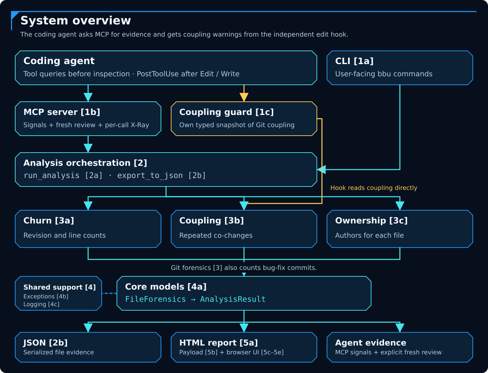
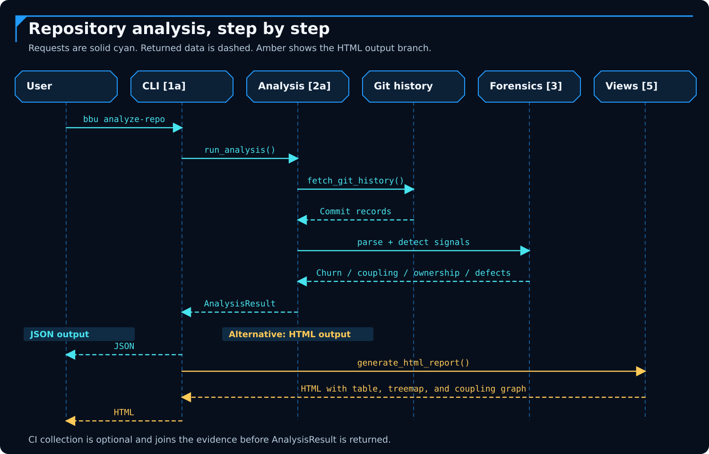
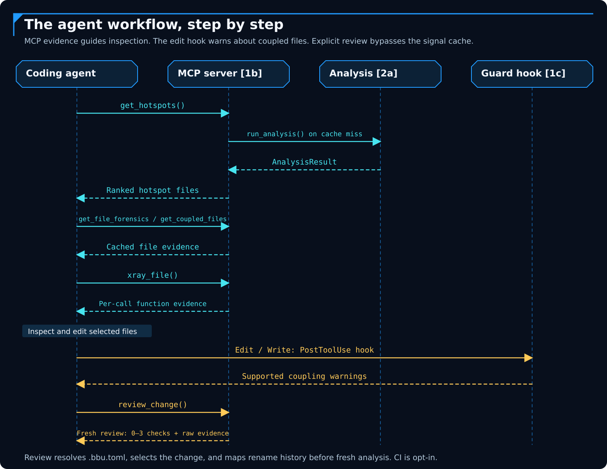
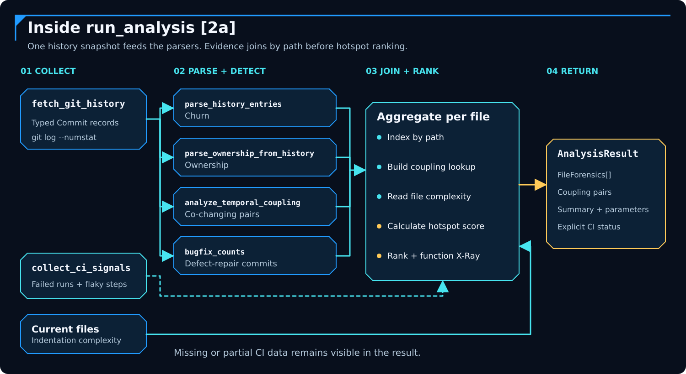
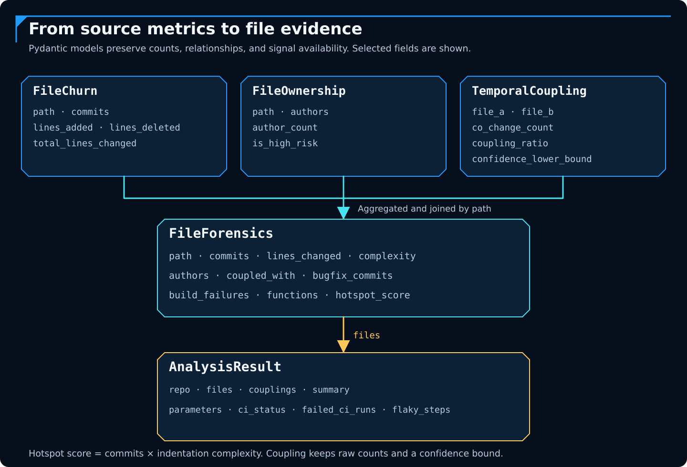
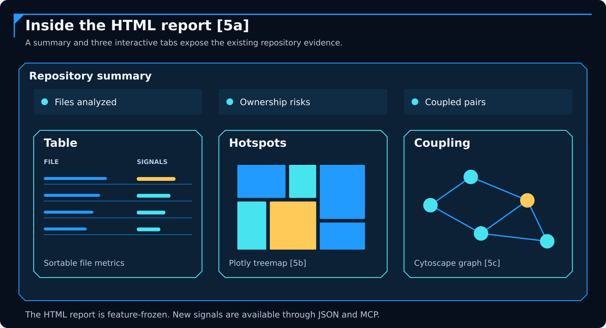

# Black Box Unlock - Code Map

> Bidirectional navigation between architecture diagrams and source code

## System Overview



## Data Flow



The agent path is the primary interface. The agent asks `bbu-mcp` for evidence
and uses the answer to choose which files to inspect.



---

### [1] Entry Points

Agent-facing MCP tools and edit hook, and user-facing commands via Typer CLI.

| ID | Component | Description | File:Line |
|----|-----------|-------------|-----------|
| 1a | CLI App | Typer application with `bbu` command | [cli.py:41](../src/black_box_unlock/cli.py#L41) |
| 1a.1 | analyze_repo | Main analysis command | [cli.py:71](../src/black_box_unlock/cli.py#L71) |
| 1a.2 | version | Version info command | [cli.py:344](../src/black_box_unlock/cli.py#L344) |
| 1b | MCP Server | `bbu-mcp` server exposing forensic signals as agent tools | [mcp_server.py:25](../src/black_box_unlock/mcp_server.py#L25) |
| 1b.1 | get_hotspots | First of six tools that read the cached analysis | [mcp_server.py:62](../src/black_box_unlock/mcp_server.py#L62) |
| 1b.2 | xray_file | Per-function churn for one file, computed on each call | [mcp_server.py:181](../src/black_box_unlock/mcp_server.py#L181) |
| 1b.3 | review_change | Fresh, uncached review of the selected change | [mcp_server.py:212](../src/black_box_unlock/mcp_server.py#L212) |
| 1c | coupling_warnings | Coupling guard behind the `PostToolUse` edit hook | [guard.py:114](../src/black_box_unlock/guard.py#L114) |

---

### [2] Analysis Orchestration

Orchestrates forensic analysis by combining data from multiple sources.

| ID | Component | Description | File:Line |
|----|-----------|-------------|-----------|
| 2a | run_analysis | Main analysis pipeline | [analysis.py:88](../src/black_box_unlock/analysis.py#L88) |
| 2a.1 | collect_ci_signals | Collect failure and flaky-step data from one typed run snapshot | [github_actions.py:217](../src/black_box_unlock/cicd/github_actions.py#L217) |
| 2b | export_to_json | Serialize result to JSON | [analysis.py:221](../src/black_box_unlock/analysis.py#L221) |

#### Analysis Pipeline [2a]



---

### [3] Git Forensics

Domain logic for extracting forensic signals from git history.

| ID | Component | Description | File:Line |
|----|-----------|-------------|-----------|
| 3a | parse_history_entries | Parse git log dict to FileChurn list | [churn.py:11](../src/black_box_unlock/git/churn.py#L11) |
| 3a.1 | extract_file_churn | Extract churn from git repo | [churn.py:38](../src/black_box_unlock/git/churn.py#L38) |
| 3b | analyze_temporal_coupling | Find co-changing files and count ignored bulk changesets | [coupling.py:19](../src/black_box_unlock/git/coupling.py#L19) |
| 3c | parse_ownership_from_history | Parse authors per file from git log | [ownership.py:9](../src/black_box_unlock/git/ownership.py#L9) |

#### Coupling Detection Formula [3b]

```text
coupling_ratio = co_change_count / min(commits_a, commits_b)

Commits touching more than 50 files still contribute to each file's commit
count, but are excluded from pair generation to avoid quadratic noise.

Interpretation:
  ≥0.30 (30%) → Hidden dependency (Tornhill threshold)
  ≥0.50 (50%) → Strong coupling
  ≥0.80 (80%) → Likely same logical unit
```

---

### [4] Core Data Models

Pydantic models and shared infrastructure.

| ID | Component | Description | File:Line |
|----|-----------|-------------|-----------|
| 4a | FileChurn | Churn metrics per file | [models.py:56](../src/black_box_unlock/core/models.py#L56) |
| 4a.1 | TemporalCoupling | File pair co-change | [models.py:81](../src/black_box_unlock/core/models.py#L81) |
| 4a.2 | FileOwnership | Authors per file | [models.py:114](../src/black_box_unlock/core/models.py#L114) |
| 4a.3 | FileForensics | Combined forensics | [models.py:244](../src/black_box_unlock/core/models.py#L244) |
| 4a.4 | AnalysisResult | Complete analysis output, parameters, and signal status | [models.py:402](../src/black_box_unlock/core/models.py#L402) |
| 4b | Exceptions | Custom exception classes | [exceptions.py:4](../src/black_box_unlock/core/exceptions.py#L4) |
| 4c | configure_logging | Loguru configuration | [logging.py:8](../src/black_box_unlock/core/logging.py#L8) |

#### Model Relationships [4a]



---

### [5] Visualization

HTML report generation with interactive visualizations.

| ID | Component | Description | File:Line |
|----|-----------|-------------|-----------|
| 5a | generate_html_report | Compose the offline document | [html.py](../src/black_box_unlock/visualization/html.py) |
| 5b | build_report_payload | Preserve AnalysisResult and enrich raw pairs | [report_data.py](../src/black_box_unlock/visualization/report_data.py) |
| 5c | report.js | Grids, selection state, charts, and signals | [report.js](../src/black_box_unlock/visualization/assets/report.js) |
| 5d | report.html | Semantic investigation-workspace shell | [report.html](../src/black_box_unlock/visualization/assets/report.html) |
| 5e | report.css | Responsive and accessible presentation | [report.css](../src/black_box_unlock/visualization/assets/report.css) |

#### HTML Report Structure [5a]



---

## Quick Navigation

| Area | Entry Point |
|------|-------------|
| CLI entry | [cli.py](../src/black_box_unlock/cli.py) |
| MCP server (bbu-mcp) | [mcp_server.py](../src/black_box_unlock/mcp_server.py) |
| Coupling guard | [guard.py](../src/black_box_unlock/guard.py) |
| Analysis pipeline | [analysis.py](../src/black_box_unlock/analysis.py) |
| Data models | [core/models.py](../src/black_box_unlock/core/models.py) |
| Git forensics | [git/](../src/black_box_unlock/git/) |
| Visualization | [visualization/](../src/black_box_unlock/visualization/) |
| Tests | [tests/](../tests/) |

---

## Module Structure

```text
src/black_box_unlock/
├── __init__.py              # Version
├── cli.py                   # [1a] Typer CLI
├── complexity.py            # Indentation-depth complexity proxy
├── analysis.py              # [2a] Orchestration
├── mcp_server.py            # bbu-mcp cached signals plus fresh review tool
├── review.py                # Request resolution, changed-path identity, and action selection
├── config.py                # .bbu.toml parsing
├── path_roles.py            # Project and built-in path-role classification
├── guard.py                 # Typed coupling-only cache + warnings (edit hook)
├── core/
│   ├── models.py            # [4a] Pydantic models
│   ├── exceptions.py        # [4b] Custom exceptions
│   └── logging.py           # [4c] Loguru config
├── git/
│   ├── log.py               # Native git log --numstat extraction
│   ├── churn.py             # [3a] FileChurn extraction
│   ├── coupling.py          # [3b] Coupling detection + bulk-commit cap
│   ├── ownership.py         # [3c] Ownership parsing
│   └── defects.py           # Bug-fix commit detection
├── cicd/
│   ├── models.py            # Typed WorkflowRun/Job/Step, CIAnalysis, FlakyStep
│   └── github_actions.py    # One run snapshot, partial-result-aware collection
└── visualization/
    ├── html.py              # [5a] Offline document composition
    ├── report_data.py       # [5b] Deterministic report envelope
    └── assets/              # [5c-e] Semantic shell, UI, styles, pinned vendors
```

---

## External Dependencies

| Tool | Purpose | Notes |
|------|---------|-------|
| git | Git history extraction | Native `git log --numstat`; no external tools needed |
| gh CLI | GitHub Actions data | Optional; unavailable/partial status is explicit and successful data is preserved |
| ECharts 6.1.0 | Risk matrix and repository map | Pinned and embedded; Apache-2.0 |
| Tabulator 6.5.2 | Virtualized evidence grids | Pinned and embedded; MIT |
